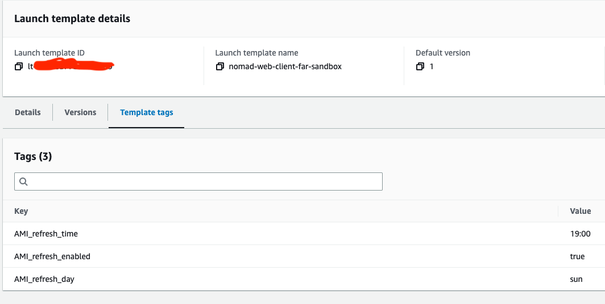
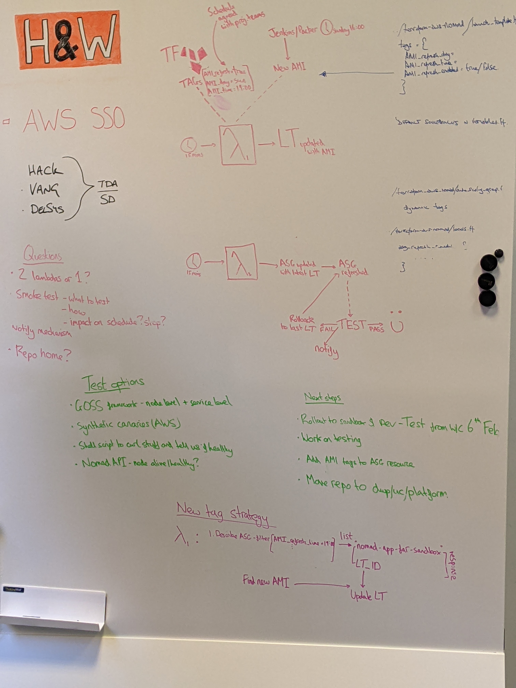
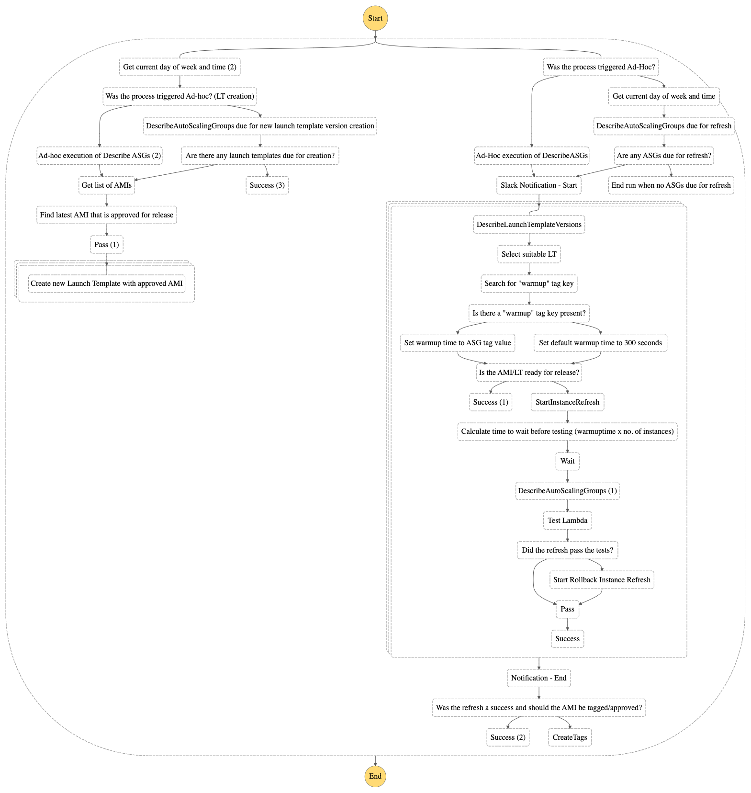

### Situation

In order to patch vulnerabilities and install software version updates so as to decrease the attack surface or servers and ensure they are equipped to support feature team applications, a process is in place within our department that builds a new Amazon Machine Image.  This is then updated within the application and infrastructure stacks by applying Terraform before finally Auto Scaling Group refreshes are manually carried out to apply the new launch templates. This manual process is carried out on a bi-weekly basis. The ASG refresh for production environment has to be carried out as an Out-of-hours task.

### Task

A project team has been assembled consisting of myself, another apprentice and a fast-stream staff member, supported by two of the senior engineers. Our task is to find a way to automate the process of refreshing the auto scaling groups and testing that they are running. This turned out to be phase one of the task/project as once we had completed this initial step we were asked to also implement automation for the AMI build and the launch template updates. 

### Action

Our first project meeting was held to discuss how we might carry out the task. We met in person, as we felt it was the best option to give us the bandwidth to share ideas synchronously, and discussed setting up a Jenkins build pipeline that could update the AMI in the launch template after building, refresh the Auto Scaling Groups and then carry out some checks and smoke tests.  Another option that we explored and discounted was to write a script using one of the AWS SDK's or CLI commands that could be placed on an instance, then run on a scheduled cron job. We then looked at AWS serverless options such as Lambda and decided that we could quickly build and deploy a Lambda that would update the Auto Scaling Group launch templates with the newly built AMI and then refresh the ASG's. We decided to create a spike of this option first to see if it would work.[(*K19*)]()

Due to the scale of the project we each took on different tasks throughout. We created a list of issues we wanted to resolve and then created tickets to tackle each issue. I first researched how we used Hashicorp Packer to build the AMI. This is done with a Jenkins build job that is scheduled to build each week. Once the AMI is built it is pushed to AWS Elastic Container Registry where it can be used by the launch templates. We discussed as a team how to trigger the Lambda that would handle the ASG refreshes and decided to use resource tagging to add meta data to the ASG's which logic in the Lambda code could use to determine if it needed to be refreshed as part of that event.

#### HACK HW-352 Implementation of default tags

The Lambda created by another project member pulls tags from the ASG for each project for comparison before updating the AMI version on the launch template.

These default tags are set in a project config module within the `variables _workspace.tf` file. I communicated with the feature teams and our team lead to agree a schedule for the automated refreshes that would not disrupt service for the public facing apps and then implemented the default schedule tags.[(*K18*)]()

```hcl

variable "ami_refresh_schedule" {
  type = map(object({
    AMI_update_day  = string
    AMI_update_time = string
  }))
  description = "An AMI update schedule for variable Valid Values are HH:MM, mon, tue, wed, thur, fri, sat, sun"
  default = {
    sandbox = {
      AMI_update_day  = "sun"
      AMI_update_time = "19:00"
    },
    dev = {
      AMI_update_day  = "sun"
      AMI_update_time = "19:00"
    },
    qa = {
      AMI_update_day  = "mon"
      AMI_update_time = "15:00"
    },
    qa2 = {
      AMI_update_day  = "tue"
      AMI_update_time = "15:00"
    },
    test = {
      AMI_update_day  = "mon"
      AMI_update_time = "15:00"
    },
    training = {
      AMI_update_day  = "mon"
      AMI_update_time = "15:00"
    },
    build = {
      AMI_update_day  = "mon"
      AMI_update_time = "15:00"
    },
    stage = {
      AMI_update_day  = "tue"
      AMI_update_time = "15:00"
    },
    prod = {
      AMI_update_day  = "wed"
      AMI_update_time = "15:00"
    }
  }
}

```
These tags are then referenced in the project config `tags.tf` and passed to outputs.tf for use in the project stacks. This gives flexibility then to the feature teams, or anyone else who may want to use the project in the future, as they are then able to override the schedule by calling the tags in a `locals.tf` file of their own project and then setting their own schedule.

```hcl

locals {
  ami_refresh_schedule = {
    sandbox = {
      AMI_refresh_day = "mon"
      AMI_refresh_time = "10:00"
    }
  }
}

locals {
  refresh_tags = merge(module.config.items.tags.refresh, local.ami_refresh_schedule[local.environment])
}

```



*Fig 1: An example of the tags on the Auto Scaling group in AWS console*

We deployed the Lambda to the Sandbox environment and implemented the tagging on one of the project stacks to be able to test. Once this was successfully implemented we held a meeting with the team leads to discuss project progress and demonstrate our solution.[(*S1*)]() The team lead liked our solution and asked us to expand on it in the next phase of the project by adding a Lambda to update the new AMI version in the ASG launch templates so that we would not need to apply Terraform to do this and also to look into how we could add notifications and tests. 

#### HW-372 Create Notification and alerting system for automated refreshes

My next project ticket was to create the Notification and alerting system. I decided to use Lambda again to trigger alerts and notifications to Slack as I had successfully implemented this previously on another project. My Lambda would be triggered by a Cloudwatch event notifying that the refresh process had taken place and also by any payload from the testing Lambda that another colleague was working on. I used conditions to determine which of these payloads was triggering the Lambda and to then act accordingly.

``` python

def lambda_handler(event, context):
# variables
  webhook_url = 'https://hooks.slack.com/services/EXAMPLE'
  channel_name = 'ami-refresh'
  log_message = event
  message = 'ASG REFRESH'
  attachment = []
  color = 'good'
  title = ''

# processing different message types 
  result = log_message.keys()
  if 'Payload' in result:
    res = log_message['Payload']['Payload']['Test_result']
    if res == 'pass':
      message = 'ASG tests passed, refresh complete'
      title = log_message['Payload']['Payload']['slack_message']
    elif res == 'fail':
      message = 'ASG tests failed, starting rollback'
      title = log_message['Payload']['Payload']['slack_message']
      color = 'danger'
  elif 'InstanceRefreshState' in result:
    res = log_message['InstanceRefreshState']
    if res == 'Started':
      asg = log_message['ASG_name']
      message = 'Starting ASG Refresh'
      title = 'Starting refresh of ' + asg

  # set up contents of message
  attachment_value = {}
  attachment_value['color'] = color
  attachment_value['title'] = title
  attachment.append(attachment_value)

# once trigger is received then send the message
  message_payload = {
    'text': message,
    'channel': channel_name,
    'attachments': attachment
  }

  req_slack = Request(webhook_url, json.dumps(message_payload).encode('utf-8'))
  response = urlopen(req_slack)
  response.read()
  logger.info("Message posted to %s", message_payload['channel'])

```

*Fig 2: My python Lambda to send slack messages*

The other project members had been working on testing that the refreshed ASG's were healthy and implementing Terraform to grant necessary permissions and to deploy the Lambda's. At this stage we held another project meeting and a show and tell session to talk through our work with other members of the team. The feedback overall was good but concerns were raised about how we were going to orchestrate the four Lambdas we now had deployed and also that our initial testing process was not sufficient to determine if applications were running as it only covered checking if the underlying instance was healthy. We decided to carry out some further research and see how we could address the concerns raised.[(*K23*)]()

For testing I looked at whether we could utilise AWS Synthetic Canaries. Amazon Cloudwatch synthetics create canaries which are configurable scripts that run on a schedule to monitor endpoints and API's. Scripts are written in node.js or Python. The script creates a Lambda function in your account, working over both HTTP and HTTPS protocols. It checks the availability and latency of your endpoints and stores load time data and UI screenshots, monitors REST API's, URLS and web content. It can run once or on a schedule using both cron and rate expressions to schedule. The output of these scripts is stored in an S3 bucket. I presented my findings to the project team and we discussed along with other options. As some of the applications running on the instances do not have endpoints and also as we would have to build in another step to pull the outputs from the S3 bucket and parse them into a format that could be understood by our test infrastructure we decided that it was not the right solution for our project and instead decided to run a check on the individual jobs in Nomad using our existing test Lambda. We also looked at how we could orchestrate our Lambda's and during the meeting diagrammed on a whiteboard what our current solution was doing.



*Fig 3: Our meeting whiteboard showing diagrams of how the Lambda's interact and possible solutions to testing*[(*S21*)]()

As our project did not have to be cloud agnostic, solving a problem that is specific to AWS Auto Scaling Groups and EC2 Instances, we looked at options within AWS to orchestrate out Lambdas. One solution stood out as being suited which was to use AWS Step functions. AWS Step Functions is a visual workflow service that provides and interface into which functions can be dropped and arranged to develop orchestration workflows. We found we could easily set up a simple workflow that would trigger the Lambda's and provide logging output. With some further research we also found that we could implement some of the functions currently being carried out by Lambda's into the step function itself.  



*Fig 4: The step function*

#### HW-428 Review and Adjust Notification Lambda

With the Step Function now handling some functionality of the Lambdas a decision was made to consolidate the remaining Lambda code into one Lambda by refactoring the code we still needed into Python classes that had single responsibilities in line with [SOLID programming principles](https://www.freecodecamp.org/news/solid-principles-for-programming-and-software-design/). The purpose of this ticket was to refactor the notification code into a class and integrate it into the other Lambda code. 

```python
class SlackNotifications:
    """Class to handle slack notifications for refresh"""

    def __init__(self, event, context):
        self.event = event
        self.type = event['notificationtype']
        self.env = ""
        self.proj = []
        self.color = 'good'
        self.notification = 'ASG REFRESH NOTIFICATION'

    def __is_plural(self, array):
        if len(array) == 1:
            return ""
        else:
            return "s"

    def start_refresh(self):
        """method to send refresh start message"""
        # Work through the asg list and pull values from each dict
        asg_ref = self.event['AutoScalingGroups']
        for i in asg_ref:
            tags = i['Tags']
            env_dict = next(
                (item for item in tags if item['Key'] == 'Environment'), None)
            proj_dict = next(
                (item for item in tags if item['Key'] == 'Project'), None)
            self.env = env_dict['Value']
            self.proj.append(proj_dict['Value'])
            asg_projects = list(set(self.proj))

        # put together message text and return
        message = f"The instance refresh is starting in {self.env} for {str(len(asg_projects))} project{self.__is_plural(asg_projects)}. Projects being refreshed are: {', '.join(asg_projects)}"
        return self.__slack_message(message)

    def end_refresh(self):
        """method to send refresh end message"""
        asg_ref = self.event['AutoScalingGroupInfo']
        self.output = {'ami_ready_for_release': None}
        fail_count = 0
        error_count = 0
        for i in asg_ref:
            res = i.get('test_result')
            if res != None:
                env_dict = next(
                    (item for item in i['Tags'] if item['Key'] == 'Environment'), None)
                if res == 'Fail':
                    fail_count += 1
                    self.color = 'danger'
                    self.notification = 'ASG REFRESH ALERT - FAILED REFRESH'
                else:
                    ami_id = i['ami_id']
            else:
                error_count += 1
        rate = ((len(asg_ref)-(fail_count+error_count))/len(asg_ref)) * 100
        if rate > 50:
            self.output['ami_ready_for_release'] = ami_id
        message = f"The instance refresh of {str(len(asg_ref))} autoscaling groups in {str(env_dict['Value'])} has completed and was {str(rate)} % successful. Please see logs by clicking <https://eu-west-2.console.aws.amazon.com/states/home?region=eu-west-2#/v2/executions/details/{self.event['execution_id']}|here>."
        self.__slack_message(message)
        return self.output

    def failed_test(self):
        job = self.event['ASG_info']['new_asg_config']['AutoScalingGroups'][0]["AutoScalingGroupName"]
        message = f"ASG tests failed for {job}. Starting rollback, manual checks advised."
        self.color = 'danger'
        return self.__slack_message(message)

    def __call__(self):
        if self.type == 'start':
            return self.start_refresh()
        if self.type == 'end':
            return self.end_refresh()

    def __slack_message(self, message):
        """private method to compile and send the message"""
        # variables
        slack_url = os.getenv('WEB_HOOK_URL')
        # Prepare and send a message to Slack with the combined payload
        # set up contents of message
        attachment = []
        attachment_value = {}
        attachment_value['color'] = self.color
        attachment_value['title'] = message
        attachment.append(attachment_value)
        message_payload = {
            'attachments': attachment,
            'text': self.notification
        }
        proxy = {"https": os.getenv("PROXY")}
        post(slack_url, json=message_payload, proxies=proxy, verify=False)
        logger.info("Message posted to uc-hack-nonprod-refresh")
```

*Fig 5: My refactored notification code*

I tested this against a dummy Step Function output in a Sandbox environment to ensure it still worked as expected.

#### HW-458 Clean up and standardise Terraform for the AMI project

With everything now in place to carry out the Ami updates, Launch template updates and Auto Scaling Group refreshes my last ticket for the project was to review and refactor the Terraform code to ensure we were following best practice and to make sure the naming conventions and project standards were aligned with those of the team and the department. The intention was to make sure that the project was usable by other teams, could be easily understood and easily adapted. Every member of the project team had been responsible for creating Terraform to support deployment of their elements and so the project infrastructure was very messy and things such as IAM roles and responsibilities, and Lambda infrastructure were repeated in different parts of the codebase.

Accepting that everyone involved in the project is at a different skill and knowledge level and as relative newcomers to the Department I approached the task in a professional manner without making any judgments or blaming any colleagues for faults or problems within the Terraform stack.[(*B4*)]() My first step was to work through the codebase highlighting any duplicated resources or resources that could be shared by multiple modules such as IAM policies. I abstracted any data I could find into a data.tf file, locals were grouped into a locals.tf file, everything IAM related moved into an iam.tf file and so on. I had to use `terraform fmt` and `terraform validate` commands after each change to ensure the code syntax and dependencies were still valid. Once I had completed this I ran a plan to ensure it would behave in the way I intended it to. I then added a README to the repository and requested it be added to the department platform.

### Result

The project was deployed initially in lower environments Sandbox, Dev, QA and with tagging only added to some of the feature team applications. This gave us an opportunity to ensure it was working properly and there were no issues or problems that may have been missed in testing. In the following sprint we added more projects and then deployed to all non prod environments. The project has been running for several weeks in non prod refreshing every two weeks and feedback has been good. The next steps for the project are to present it to a Governance working group to gain approval to deploy it to Production. If approved this will benefit out team directly as it will save hundreds of man hours currently taking up with out of hours updates of the production applications. There has been interest from two other DevOps teams we work closely with who also want to use it.

This project has been a valuable experience for me as it has allowed me to work on a new tool from the ground up, one that has real world applications and in a working environment alongside colleagues of a similar skill level. I have been able to gain planning and presentation skills, learn about new technologies, apply my problem solving and coding skills to resolve issues and have the satisfaction of the finished product being in use within the team.