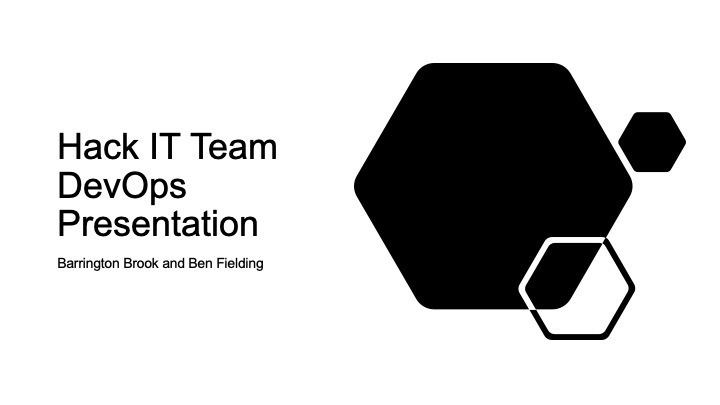
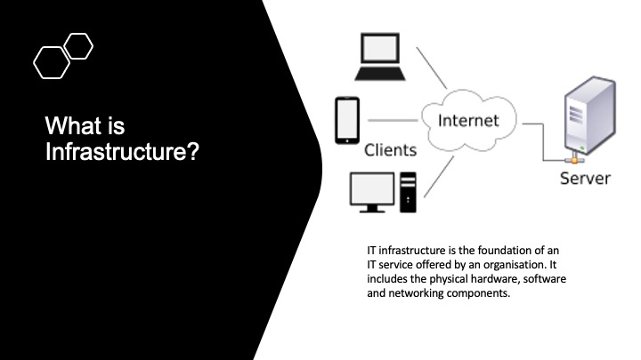
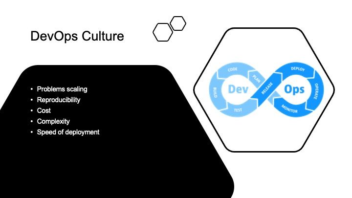
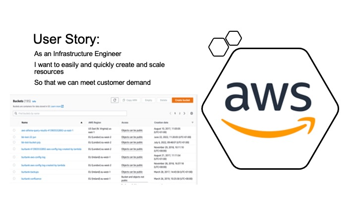
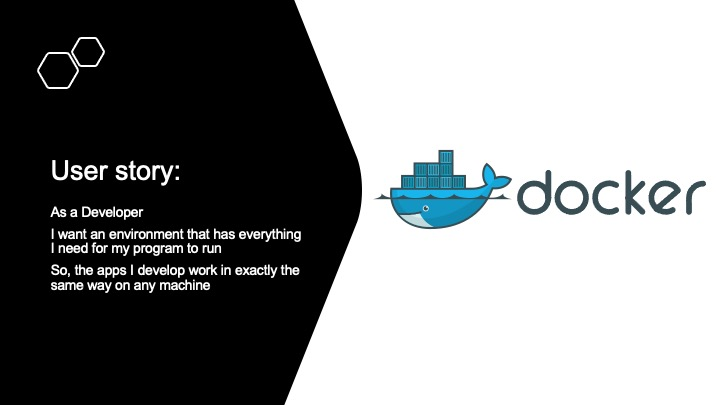
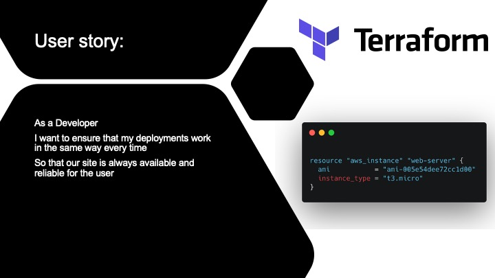
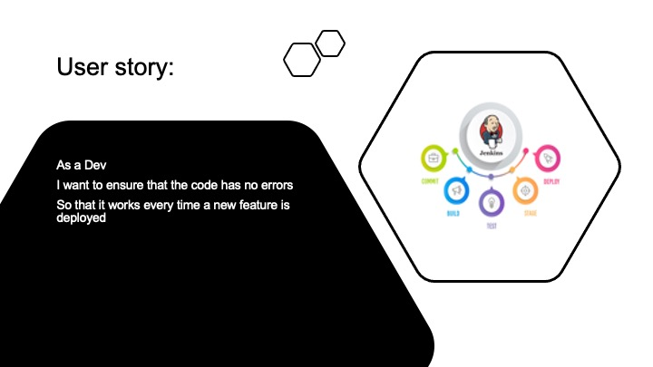

### Situation

Both myself and the other apprentice on my team were asked to put together a presentation to deliver to the Portfolio team during a monthly meeting. THe HackIt team tech lead wanted us to try to demystify some of the technology and terms we used day to day to provide infrastructure for the developers.

### Task

Our task was to prepare a presentation to be delivered to a non technical audience using powerpoint, or any similar presentation tool, which was to be fifteen to twenty minutes long. We had six weeks to prepare our material and deliver the presentation.

### Actions

### Result

