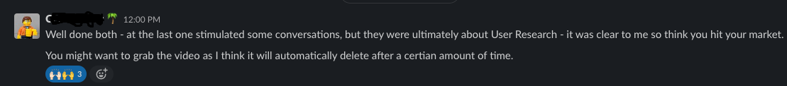

#### Situation

Within DWP Digital we have a Portfolio team who have overall responsibility for the products and feature teams. When our team need to give updates on progress with platform infrastructure for apps or new products there is sometimes confusion about the tools, processes and language we use as the team is non-technical.

#### Task

Myself and another apprentice were asked if we would prepare and deliver a  15 minute presentation to facilitate knowledge sharing with the Portfolio team. We would deliver this presentation at the next Portfolio team meeting via a Teams call and could choose whichever medium we thought most suitable for the presentation.[(*S4*)]()

#### Actions

Our first step was to meet and decide what form our presentation would take and what information we would need to include. Our meeting took place online and we used Mural as a virtual whiteboard to brainstorm our ideas and keep a record of what we had discussed.

We decided that using Powerpoint would be the best way to deliver the presentation, we looked at other options including Mural and Google Slides however we are unable to use google products on our machines and did not have much experience with using Mural as a presentation tool.

We put together a rough powerpoint with a slide for each topic we had decided to cover in our whiteboard session and researched 3 topics each before writing up some delivery notes. We gave this outline then to our line managers to review and give feedback before fleshing it out again. 

I built up the slides with images and titles and my colleague suggested that it would be a good idea to present each technology in the context of a user story that we could then use to present our solution in the form of a devops tool that we use. I thought this was a really good idea and gave us some experience in writing coherent user stories. We each wrote a user story for the slides we had researched and worked on the slide layout and styling together to ensure that we were presenting the information in a format that was easy to understand.

Once we were satisfied we had a good presentation we arranged to present it to our team Delivery Manager and a Senior in the team so we could practice the delivery and timings and ensure that it made sense to both a technical and non-technical audience. We asked for feedback on the presentation and then carried rewrites adn revisions based on those notes.

#### Result

We delivered the presentation below to a broadly non-technical audience of portfolio managers over a Teams call.

*fig 1: Slide 1 of the powerpoint*

Transcript:
BEN FIELDING: we're Barrington and Ben, Dev OPS engineer apprentice apprentices, and we started with DWP engineering in May. We work with the HACKIT and whip it team who are a dev OPS team that build and support infrastructure for products and projects on the Burbank and UC platforms. What we're going to do is give you a kind of simple overview of infrastructure servers, networking and limitations of on premises. We're gonna talk to you a little bit about the DevOps culture, which we're going to link to some user stories which will hopefully highlight some of the services, products and tools that we commonly use to provide a platform for the developers to deploy to. So hopefully by the end of this you should kind of have an idea of how a web application works and how we facilitate the journey from developer to the end user, as well as some of the terms, technologies and concepts that we use to do that. So firstly, I'll hand you over to Barrington to talk a little bit about infrastructure.

*fig 2: Slide 2 of the powerpoint*

Transcript:
BARRINGTON: Thanks, Ben. The first thing to point out is that DevOps practices and culture is relatively new. So we just thought it would be useful to talk about what these processes and what this culture is replacing. I want you to imagine it's 2008 and you want to launch a website web app. You buy a server, basically just a big computer. You plug it in, you pay a person to set it up. This means installing all the software needed for the website, keeping the system maintained, keeping an eye on storage memory usage. Someone has to look at security backups. You need to connect it to a network, configure the network settings and this will include physical cables, probably an internal system of some sort, emails, packages, things of this nature. So a lot of work. The developers just write the code and give it to the server maintainer. They don't care about the computers, they just want their code to run. One day there was a problem
with your server, the website's down. You manage to get it fixed, but you don't want to stop it again. So you purchase a second server that also serves this web content. You want to spread the load between these two servers to increase performance and that means having a piece of hardware or a computer program that forwards the web traffic between these two servers, but also checks the service to make sure that they are receiving and responding to the user requests.

But now there's a problem. You have to make sure the software and configuration that you did on the 1st machine is now exactly the same on the second machine. If this isn't the case, the developers code might work on one but not on the other, or it might work on the other but in a different way. This is manageable, but you can see it's getting a bit fiddly at this point. The server maintainer is probably writing programs to make some of this work easier, but they will probably require some level of maintenance as well. Anyway, you've got a website you're happy with. It's going well. It starts to get successful. In fact, it's getting very successful. You're buying new servers all the time and each one you have to do the same work setting up that you have to do before. In fact, it's actually getting a bit harder. One day you're told that some aspect of your website isn't working. You're getting complaints. The code works on the developers computer and has passed all of the tests, but when it's uploaded to the server to be served to the user, it doesn't work. Now you have a pretty difficult job of working out where the potential problem is. Keep in mind you're not the developer. You don't know anything about the code because you're spending all your time trying to keep these servers online, so maybe you're starting to see some of the problems that exist with this way of working. The developers and the server maintainers, have poor lines of communication. They're more or less working independently and don't know what the other ones up to. Scaling is difficult because of the time and work and man hours necessary to get a new server up and running. And the more complex your website or application becomes, the more complex managing it becomes. Now Ben's gonna talk about how DevOPS resolves or begins to resolve some of these issues.

*fig 3: Slide 3 of the powperpoint*

Transcript:
BEN FIELDING: Thanks Barrington. So DevOps really is a combination of culture, practices and tools that aims to increase the flow of value from the developer writing the code to the end user by improving the flow of communication. Making development more efficient, identifying cutting edge tooling that improves the efficiency of deployment cycles, and empowering the developers to do what they do best and write code. We use tools that solve the problems of scaling so we can meet demand, such as in the early stages of the pandemic, when our users grew from 3,000,000 to 5.2 million and was further compounded with job centres being closed.

We use infrastructure as code so we can save our infrastructure, making it easily reproducible, easy to read, easy to be stored and shared. This makes the deployment process faster and less complex. We automate as much as we can to keep the the journey from the code being written to reaching the end user as simple as possible. And to show you some of these tools and kind of how we do what we do, we're gonna take you through some user stories that will hopefully give you a better idea of how this all works.
So firstly, Barrington's going talk to you about AWS.

*fig 4: Slide 4 of the powerpoint*

Transcript:
BARRINGTON: Thank you.
So as an infrastructure engineer, I want to easily and quickly create and scale resources so that we can meet customer demand.
This seems like a relatively simple thing to ask , most of these tools and ways of working currently in Hackit team are done using AWS.
All the tests and processes that I mentioned before that would previously have comprised of physical objects and people within our organization are now handled remotely in the cloud and can be managed either through writing software or using a web user interface.
I'll now briefly go through a few terms that are associated and you might hear associated with DWP, feel free to ask questions if this isn't clear, but I'm just gonna go through a few terms. The first is EC2.

EC2, or you may hear an EC2 instance, is a virtual computer that can act as a web server. We're able to configure security, networking, storage on these instances very easily, and it makes it a very flexible alternative to a physical on premises server. One of the advantages of this is it's very easily reproducible so we can scale to meet demand quickly just with the push of a button. You don't have to buy a service, set it up as I said before, and it can also be removed to scale down, which can save money.

The next term, uh route 53 or AWS Route 53 is what is called a DNS service. This basically means when the user is typing in an addressing their browser the request knows exactly which computer to go to, which server to go to to get the information that they want.

You may also hear about S3 buckets. Imagine when you hear S3 buckets or S3 or Amazon S3. It's basically just storage. It's like a file on your computer. It's just stores objects and it stores files.

The next concept is Cloud Watch. This basically does what it says on the tin. It offers insights into performance, potentially anomalous behavior in the form of logs, metrics and events so we can have better insight into how the system is working or how it's not working as the case may be.

And the last concept is maybe one of the more important ones and that is VPC. This stands for virtual private cloud and this is everything that I've discussed so far sits within a virtual private cloud, which is basically our own isolated section of the AWS cloud. The important thing to remember is the cloud is basically just a big room full of computers that AWS earns and we can access as many of these that we want for a price, and they could be managed by the user in an interface or by us programmatically very easily.
Uh. Onto you, Ben.

*fig 5: Slide 5 of the powerpoint*

Transcript:
BEN FIELDING: Our next user storie is that as a developer I want an environment that has everything I need for my program to run. So the apps are developed work in exactly the same way on any machine.

Docker is a tool that we use to package applications as portable container images that will run in any environment consistently. This allows the developers to deliver applications easily and know that they'll run the same way in all environments from development through through to production. A docker container is basically like a box that contains all the dependencies. Everything an application needs to run and an image is a snapshot of this setup that can be easily shared and stored for use time and again. So this way of working ensures that whether the end user is accessing the site from a Mac, PC or mobile phone, it will behave in the same way that the developer intended every time.

We write configuration files that tells Docker what to include in our base image, and then this is shared with the developers who can use this image to deploy their app.
And the next user story's about Terraform, Barrington.

*fig 6: Slide 6 of the powerpoint*

Transcript:
BARRINGTON: Yep. So as a developer I went to ensure that my deployments work in the same way every time so that our site is always available and reliable for user. You may have noticed the general trend of reliability and availability and infrastructure as code. These are some of the core DevOps practices. With regards to what Terraform actually is, it's essentially a program.

Whether it be AWS or any other cloud platform we can set-up and configure all of the infrastructure within the browser console, but this might be a time consuming process and we might not set-up the infrastructure in the same way each time. So we use this tool Terraform to deliver infrastructure as code which allows us to automate building our infrastructure and makes the configuration storable, repeatable and shareable. If you look at this little box here, there's some code saying resource AWS instance Web server.
Yes, alongside lots of other code when run will basically just allow us to access an EC2 instance to use as a web server in the AWS cloud, so we don't have to buy a computer, we have to buy a server. I set it up, we just type this code in, run it and then it'll automatically appear within our platform.
Moving on to you then.

*fig 7: Slide 7 of the powerpoint*

Transcript:
BEN FIELDING: And our our final user story is that as a dev and as a whole department, we want to ensure that the code we we commit and and publish has no errors. So it works every time a new feature is deployed and in order to ensure that the releases work in the same way every single time we build pipelines that test the developers code and our infrastructure every time a new feature is staged for release.
Something I could use to compare a pipeline to would be a factory production line where the code rolls along a conveyor belt with jobs being carried out at each step before it goes into production and is released to the public. So we use a tool called Jenkins and this allows us to configure jobs. Each stage of the build our code tests the way the code is written to ensure that it meets syntax standards, unit tests test the code to ensure it works, and then checks that it can be deployed to the infrastructure we've created with Terraform and AWS. Obviously in the old world these would have all had to be done individually, which would be a very time consuming process and we set these pipelines to be triggered by code commits or merge to test in staging or production branches.
And again, all of this is done using infrastructure as code. So we write a configuration file that carries out everything that we need.
So that is a bit of an overview of everything that we we use and what we we typically try and do for the developers.
So if you have any questions now, we will endeavor to answer them.

*fig 8: Slide 8 of the powerpoint*

There were no questions asked at the end of the presentation and we received some good feedback from the people in attendance who felt it had cleared up some of their confusion and knowledge gaps about how the developer and operations teams worked together to provision the Universal Credit website. We also received positive feedback from our line managers following the presentation which demonstrates that we communicated clearly and credibly to our audience. [(*S1*)]()

*fig 9: Feedback received following presentation*

*fig 10: Feedback received following presentation*

This task gave me an opportunity to look closely at the common tools and services that we use as a team. It highlighted for me how the different teams within DWP digital work together as a collaborative community. And it was a good opportunity to work with a fellow apprentice to complete a task. [(*B1*)]()
