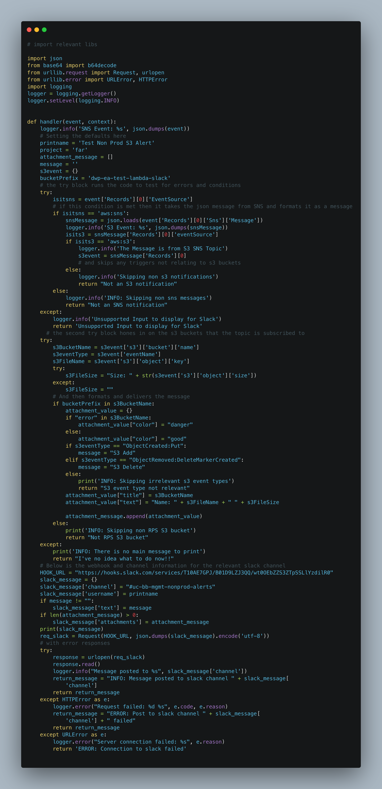
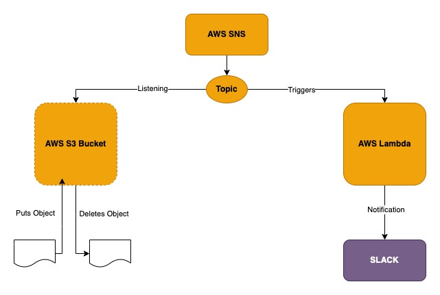
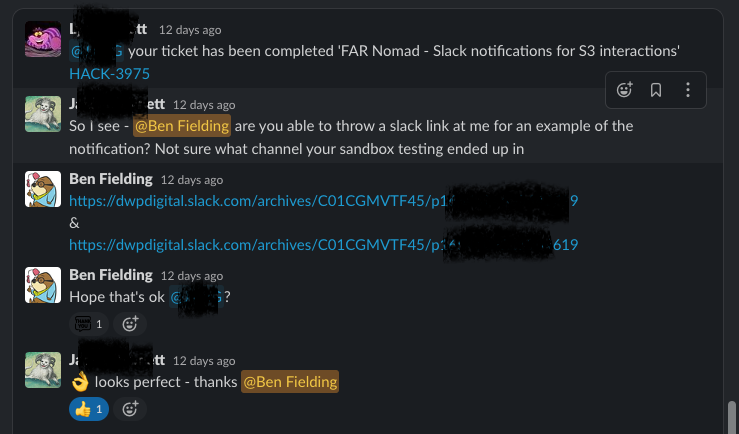

#### Situation:

A request for a feature was added to team Kanban board. In a legacy project the Devs received a notification to a Slack channel whenever a file is added
or deleted from their S3 buckets. They were requesting that this functionality be added to the current project.

> As a developer I would like to receive a notification into the #uc-far-prod-alerts Slack channel whenever an object is added to or deleted from the new
S3 buckets. The alert should contain the following information: Bucket name, file name, size of file in bytes

---

#### Task:

Deploy a Lambda function to the existing infrastructure, using Terraform, which will listen for actions in the projects S3 buckets and then send notifications 
to the relevant Slack channel. This would involve setting up additional infrastructure for the AWS SNS service and for the Lambda function.

---

#### Actions:

I met with my line manager and discussed how I could go about resolving the request in the ticket and what I would need to do. My LM arranged access to the 
legacy account mentioned so I could look at the Lambda function there as well as any roles, permissions and SNS settings that I might need to familiarise myself
with. We agreed that I would outline a plan for my approach and discuss it with him.

**My Plan**

* Research AWS Lambda and decide if the legacy account Lambda could be revised and resused in the new project
* Research AWS SNS and the new concepts of topics and subscriptions which would needed
* Set up the infrastructure to deploy the Lambda function in a sandbox environment within an example application Terraform stack in the exisiting codebase
* Test that adding or removing objects from a test bucket triggered notifications to my Slack
* Move the changes into the project Terraform stack and through sandbox, stage and finally production

My LM agreed this was a good approach and so I moved the ticket into 'in progress' and started to work.

The Terraform stack for an example application within our codebase introduced me to new concepts that I had not covered in the bootcamp. The Terraform is 
split into modules that do different things within the infrastructure such as creating S3 buckets, creating IAM roles and setting permissions, setting up the 
network, and deploying a Lambda function. The modules are all version controlled within a GitLab repositories and to call a module into the project for use
you add the module URL and version to a Terrafile. I updated the Terrafile to include a Lambda module and an assume IAM roles module as these were missing from the example application project. I then identified which files within the project I would need to append or alter. These were:

* iam.tf - which contains all of the IAM roles, granting permissions for the Lambda
* project.tf - which invokes the different modules
* lambda.tf in the lambda module - to set up infrastructure for the Lambda function, zip the lambda and deploy it
* I also had to place the lambda_function.py file in a /src directory at the root of the project so it could be zipped and deployed

**The Lambda Function**

I took the Lambda function that was deployed in the legacy project and initially only modified the Slack webhook and channel to see how it would behave when deployed.

> AWS Lambda is a serverless, event-driven compute service that lets you run code for virtually any type of application or backend service without provisioning or managing servers. You can trigger Lambda from over 200 AWS services and software as a service (SaaS) applications, and only pay for what you use. 



*An AWS Lambda is a piece of code that performs a function, the comments explain what each section of the code does*

To set up permissions for my Lambda I initially implemented a generic service role for the lambda that would give access to all the resources with the intention to lock this down once tested and out of the sandbox env. 
I realised once I started trying to run my terraform plan that I was experiencing a lot of errors with missing or mislabelled dependencies. I didn't need the assume-role module and I needed an SNS module that would set up my topics and subscriptions to trigger the lambda.
At this point I felt I had too many dependencies already failing so I moved key parts of the SNS module into my project with an sns.tf file. I still could not get the function to trigger when I added or deleted from the test bucket so I explained in stand up I was blocked and paired with a colleague to try and resolve my issues.
On a teams call, sharing desktops, we went through my Terraform and my colleague spotted that I had not set some permissions in my sns.tf file for the lambda function and I had not created a sns topic to subscribe to the bucket and listen for events. 
My colleague explained how this should work and I have diagrammed it below.



With these changes in place we could see that proof of concept worked and the Lambda was being triggered but the Cloudwatch logs showed that it was not sending the Slack notification.
We worked through the Terraform stack and my colleague identified that the VPC created in the Sandbox environment would not allow the Lambda to communicate out to Slack.
This led me to talk to one of the network architects on the team who advised that all we needed to do to test was to remove the elements of the original project that set up VPC rules for the Lambda. I did this and managed to generate a slack notification.
With all of this in place within the sanbox environment I raised a request to merge my code into the main example application repository.

My line manager picked up the merge request and identified some further actions:

* I needed to properly update my changes in the README for the example application
* I needed to properly lock down permissions in the IAM role I was creating rather than using wildcards to grant excessive permissions
* I needed to update the .gitignore file so it would not upload the zipped Lambda file to the GitLab repository

Once I had corrected these my branch was merged and I could start to integrate my infrastructure into the actual project.
* I created a new branch within the project repo following the team naming conventions.
* I lifted and shifted my Terraform code across to the new branch

I then ran Terraform plan which generated naming errors and duplicated resource block errors which I went through and debugged. On running Terraform plan again it generated errors which told me that my Terrafile contained out of date versions. I rebased my code against the main branch and running the plan again, it generated a plan without any errors.
My next step was to speak to a colleague working with this specific project to identify which S3 buckets would need to trigger the notifications and to ensure that I would not cause any problems running and testing my deployment in the sandbox environment.
The testing worked in the sandbox environment and I again submitted a merge request to integrate my test branch into the main project. At that time I had hard coded the Slack webhooks for the staging and production environments into the Lambda code and it was suggested that I add environment variables instead. I added the webhooks to the locals.tf file:
```
locals {
  channel_name = {
    sandbox  = "#uc-bb-mgmt-nonprod-alerts"
    dev      = ""
    qa       = ""
    qa2      = ""
    test     = ""
    training = ""
    stage    = "#uc-far-status"
    prod     = "#uc-far-prod-alerts"
  }

  web_hooks = {
    sandbox  = "https://hooks.slack.com/services/T10AE7GPJ/XXXXXXXXXXXXXX"
    dev      = ""
    qa       = ""
    qa2      = ""
    test     = ""
    training = ""
    stage    = "https://hooks.slack.com/services/T10AE7GPJ/B037316H4GJ/XXXXXXXXXXXX"
    prod     = "https://hooks.slack.com/services/T10AE7GPJ/B03HSA0FKC5/XXXXXXXXXXXXX"
  }
}
```
Then I updated the Lambda slack function module with the environment variables:
```
module "lambda-slack-function" {
  source                  = "./vendor/modules/terraform-aws-lambda"
  config                  = module.config
  data                    = module.data
  lambda_function_name    = "lambda_slack_function"
  lambda_payload_filename = "./src/lambda_slack_function.py"
  lambda_handler          = "lambda_slack_function.handler"
  lambda_timeout          = 300
  service_role            = { arn = aws_iam_role.lambda_slack_function.arn }
  environment = {
    variables = {
      CHANNEL_NAME = lookup(local.channel_name, local.environment)
      WEB_HOOK_URL = lookup(local.web_hooks, local.environment)
    }
  }
```
---
**Result**

With everything tested and merged I completed the ticket and moved into 'Done'.

The work I had done received good feedback from the team that had generated the feature request, as evidenced below-



I feel this was a really good first ticket as it taught me how the Terraform projects in my team are structured. It taught me about how large IaC projects with Terraform can be broken down into modules for each part of the project. It taught me about how AWS SNS service works to listen for events and trigger Lambda's that can be used to send notifications and it taught me a lot about the version control process and conventions within my team, documenting my process and gave me an opportunity to get to know and work with other members of the team. I also had an opportunity to see how a new feature or product moves through stages from Sandbox to production. One really valuable lesson I will take from this ticket is to pull from the main branch of the project repo every day and rebase your branch code. Working on a branch of a major project means lots of other people are working and making changes which can affect how your feature code works if you don't keep up with those changes.

I feel I still need to do some more research into how VPC's work and what the network modules do within the projects Terraform stacks as I did not really need to touch these as part of the project. I am following a Terraform path on Pluralsight to help fill in my knowledge gaps in this respect.

I don't feel I would do anything especially differently as I was guided through this well by my line manager and team members.

