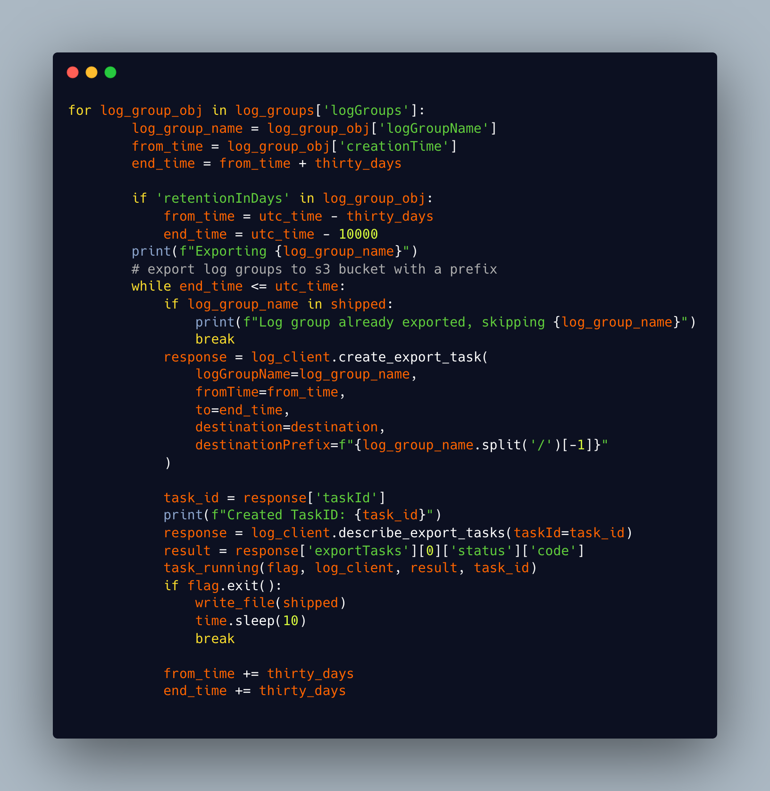

#### Situation

Team HACK use multiple AWS accounts to provision infrastructure for each project that they work on. Older projects built with Terragrunt are archived and so the team is unable to use Terraform to destroy the created resources. These resources are generating costs each month for services that are no longer running.

#### Task

Myself and another apprentice on the team were given a project to audit these legacy accounts, record costs and then devise a solution to automate the removal of resources after migrating app logs to a new, dedicated log account. With the help of the delivery manager and tech lead we broke the 'Epic' into more manageable tasks that we could complete individually or pair up on. First we would audit and record costs for each account, secondly we would test our automation on non production accounts with a set of project tags and finally we would decommission and remove the legacy production resources. We would then be able to show cost savings to DWP.

#### Action

We used Cloudability alongside AWS cost management to export an excel of the relevant project tags and associated costs for the accounts.
We decided to each look at a different aspect of the task so my colleague started to investigate automating the migration of logs to a dedicated account. I started to look at how I would automate the deletion of resources.

I first spent some time looking at AWS documentation and performing a Google search to see if I could find any further information or options for automating this task. I quickly found software that was available called [AWS Nuke](https://github.com/rebuy-de/aws-nuke) which is a tool that removes all services and resources from a given account. After reading the documentation I decided this would not be an appropriate service to use as the task was to remove selected resources with specific project tags. I decided that a bespoke solution was required and I decided to wrap AWS Cli commands within a bash script with some user input to provide account names and project tags.[(*K24*)]() This would allow the user to target deletion of only the project tags they had selected. I created some resources in the non prod account to test my script and everything seemed to work.

*Fig 1: The first iteration of my bash script to delete s3 buckets*

Once I tried to use the script on real resources I started to experience errors and the scripts were not performing as I had expected. I received error messages indicating that 'versioned' buckets cannot be deleted. After reviewing the bucket settings and reading the AWS Cli documents I realised I would have to implement some further steps to my script to delete first versions, then delete markers, then the objects within the bucket and finally the bucket itself. Delete markers are a placeholder for a versioned object. In versioning enabled buckets the objects, if deleted, are not actually deleted but the delete marker makes it behave as if deleted. These markers have to be removed first before the bucket can be fully deleted.

My second iteration of the script added additional commands wrapped within functions to delete the version markers and delete markers in the buckets. I worked through this slowly using errors to debug and improve my script

*Fig 2: The next iteration of my bash script*

I devised and tested two further scripts to delete Elastic Container Services and Registries based on my S3 script. I then worked through the project tags in the non prod account on my first ticket to remove all services, leaving only the log buckets to be migrated as part of my colleagues work.

Work on the next ticket in the project required export of Cloudwatch logs to an S3 bucket so they could be migrated along with other logs. I attempted to build a script to automate this task but ran into problems as I had to set start and end dates for the export using Unix epoch time. To do this I had to access the creation time of the object using 'jq' which is a json tool for bash. This created a lot of problems with parsing the time from Unix to UTC and after discussions with my line manager, he suggested that I look at the Python boto3 library. Boto3 is the Amazon Web Services (AWS) Software Development Kit (SDK) for Python, which allows Python developers to write software that makes use of services like Amazon S3 and Amazon EC2.

After reading the documentation I decided this was the best option. I found some examples that suited my use case and started to adapt them. I had a working script and started testing but found that you are limited to only one log group export task per account so had to put a conditional statement in to hold the loop until the current export has finished. This worked until it hit a log group with a retention policy of 30 days. This threw an error as the oldest log date did not match the creation time date I was using as a from variable in the export. I had to look at how to check if retention was in the log group and then use that rule to set a new creation date at the start of the retention period. I settled in the end on
`for 'retentionInDays' in log_group_obj:` as my condition which again on a small test worked. I ran a basic test using pylint to check it was ok, formatted correctly and not throwing any syntax or attribute errors.

*Fig 3: Part of my Python script to export Cloudwatch log groups*

I took the opportunity whilst waiting for the Cloudwatch log group exports to complete to refactor my first set of bash scripts into Python as well.

My colleague was working to migrate logs to a new log account and encountered a blocker which we discussed. Logs that had been archived using AWS Glacier Flexible Retrieval storage class could not be migrated without a process involving retrieving them from storage, copying them to another S3 bucket and then moving them to a new account. We discussed how we could resolve this and also asked our team if they had any solutions. One of the team advised that if we created a bucket with a replication policy then we could copy the files easily within the source account and they would be replicated in the log account without needing to replicate. We decided that this was the route we would take to save some time and assigned ourselves tasks to complete this. I would write another script that would retrieve the objects from storage then copy them to a created S3 bucket with replication policy attached.

First iteration of script worked but took a long time, errors re running script when items were already in the process of being retrieved. Implemented error handling. Read about pagination in boto3 and implemented this. Still running slowly so tried parralelism and implemented this (carries out 10 tasks at once). Installed script on ec2 instance so it could run in background and complete work without interruption. Retrieve then copy and automatically replicated in destination account.

Final part of my task was to prepare suitable documentation to explain the process and how to use the scripts.

#### Result

Outline of tickets/projects/accounts that we have worked in. Savings made.
What did I learn and how did this benefit the team and the business?

Short run through of use of my automation in the FAR ticket and further improvements made such as parrallelism and running on an instance to avoid timeouts caused by the VPN timing out etc

Agile - iterations of my scripts to improve the process and handle new problems.
Any other KSB's and references? S8
