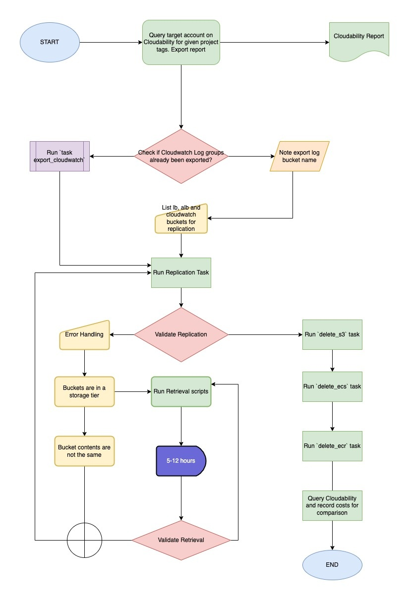
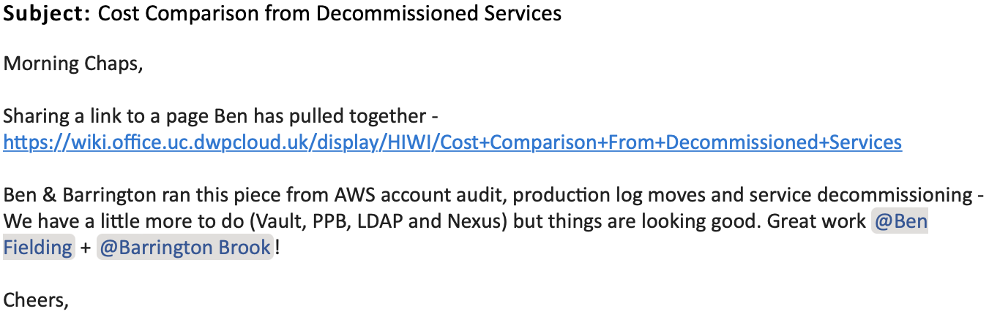

### Situation

Legacy accounts were created for dedicated applications which are now defunct with resources in these accounts still incurring costs to the organisation. Automating the deletion of AWS resources in legacy accounts is required for reducing costs and security risks.

### Task

My colleague and I were tasked with auditing legacy accounts, recording costs, and creating a solution for automating the removal of resources after migrating application logs to a new and dedicated log account. We discovered that our current manual processes were inefficient and time-consuming due to the sheer amount of accounts that needed to be audited, and the number of resources in each account. The solution we proposed was to create a set of scripts that could be run to delete cloud resources after they had been migrated, reducing the time it took to decommission an account by a considerable amount.

### Action

Working with the delivery manager and tech lead, we broke the 'Epic' into more manageable tasks. We began by auditing and recording costs for each account, and then testing our automation on non production accounts with a set of project tags and resources mapped. We then identified opportunities for cost savings, and created scripts to automate resource deletion. Finally, we successfully ran the automation script across the legacy accounts, reducing costs and risks associated with them.

To audit the legacy accounts I exported reports from AWS cost management for each account. I then used Cloudability, which is a cloud management platform that provides organisations with tools to manage and optimise their cloud spending, to create a dashboard which we would be able to use to track cost savings over the course of the project.

We were set up with our own Kanban board by the team delivery manager so we could assign tickets to ourselves and work on different aspects of the project simultaneously. Whilst my colleague looked at a process to migrate logs to the new log account,  I started to look at how I would automate the deletion of resources.

I first spent some time looking at the official AWS documentation and performing a Google search to find out if there were any other options available for automatically deleting resources. I quickly came across a software called [AWS Nuke](https://github.com/rebuy-de/aws-nuke) which is a tool that would remove all resources in the accounts including snapshots, EFS, EC2, RDS, and Lambda. After looking at the documentation and reading the reviews, I decided that this would not be an appropriate service to use as our task was to remove select resources from the accounts. I then looked for something more customizable, and came to the conclusion that a bespoke solution using a bash script with AWS CLI would be the most suitable for our requirements. Exploring these differences between Software as a Service(SaaS) with something like AWS Nuke, Enterprise solutions such as AWS tools and creating a bespoke set of tools for my problem I created the following table:[(*K24*)]()


|   | Software-as-a-Service (SaaS) | Bespoke | Enterprise Tooling |
|---|---|---|---|
| Pros |
| | Cost-effective | Tailored to specific needs | Offers extensive customization |
| | Easy to use and deploy | More control over functionality | Offers advanced features and capabilities |
| | Scalable | Purpose built features and functionality | Integration with other enterprise systems |
| | Accessible from anywhere with an internet connection | Not tied to a supplier | Strong security and compliance measures |
| | Automatic updates and upgrades | Easy to change and update | More suitable for large-scale projects |
| Cons |
| | Less customization | May not be as secure | Can be complex and difficult to deploy |
| | May not integrate with other systems | Requires more research and planning | Requires dedicated resources |
| | Dependence on vendor for support and maintenance | May not meet all business requirements | May have longer development times |
| | Data security concerns | May not be scalable | May have high licensing costs |


*Fig 1: The first iteration of my bash script to delete s3 buckets*

Whilst my script worked perfectly on resources created for testing, once I tried to use the script on resources in the legacy accounts I started to experience errors with the scripts not performing as they had in tests. The error messages indicated that 'versioned' buckets cannot be deleted. After reviewing the bucket settings and reading the AWS Cli documents I realised I would have to implement some further steps to my script to delete first the version markers, then the delete markers, followed by the bucket objects before finally deleting the bucket itself.

> Delete markers are a placeholder for a versioned object. In versioning enabled buckets the objects, if deleted, are not actually deleted but the delete marker makes it behave as if deleted. These markers have to be removed first before the bucket can be fully deleted.

For my second iteration of the script I decided to add functions to handle the deletion of the versions and markers. This made my script easier to understand and debug as each function handled a specific task. I then used a systematic debugging approach to revise my script based on the errors it was generating until it worked to carry out the s3 bucket deletion. 

*Fig 2: The next iteration of my bash script*

I devised and tested two further scripts to delete Elastic Container Services and Registries based on my S3 script. I then worked through the project tags in the non prod account on my first ticket to remove all services, leaving only the log buckets to be migrated as part of my colleagues work.

Work on the next ticket in the project required export of Cloudwatch logs to an S3 bucket so they could be migrated along with other logs. I attempted to build a script to automate this task but ran into problems as I had to set start and end dates for the export using Unix epoch time. To do this I had to access the creation time of the object using 'jq' which is a json tool for bash. This created a lot of problems with parsing the time from Unix to UTC and after discussions with my line manager, he suggested that I look at the Python boto3 library. Boto3 is the Amazon Web Services (AWS) Software Development Kit (SDK) for Python, which allows Python developers to write software that makes use of services like Amazon S3 and Amazon EC2.

As a result of reading the documentation, I decided that this would be the best option. I found some examples that suited my use case and adapted them. As soon as I had a working script, I started testing, but I discovered that you are only allowed one log group export per account, so I had to put a conditional statement in to hold the loop until the current export was finished. It worked until it reached a log group with a 30-day retention policy. In the export, the oldest log date did not match the creation time date I was using as a variable. As a result, I needed to check whether retention was in the log group and then use that rule to set a new creation date. I settled in the end on
`for 'retentionInDays' in log_group_obj:` as my condition which again on a small test worked. I ran a basic test using pylint to check it was ok, formatted correctly and not throwing any syntax or attribute errors.

*Fig 3: Part of my Python script to export Cloudwatch log groups*

I took the opportunity whilst waiting for the Cloudwatch log group exports to complete to refactor my first set of bash scripts into Python as well.

My colleague encountered a blocker in his ticket to migrate logs across accounts, which we discussed. Logs that had been archived using AWS Glacier Flexible Retrieval storage class could not be migrated without a process involving retrieving them from storage, copying them to another S3 bucket and then moving them to a new account.[(*1*)]() We discussed how we could resolve this and also asked our team if they had any solutions. One of the team advised that if we created a bucket in Terraform with a replication policy then we could copy the files easily within the source account and they would be replicated in the log account without needing to set up permissions to copy across accounts. We decided that this was the route we would take to save some time and assigned ourselves tasks to complete this. I would write another script that would retrieve the objects from storage then copy them to a created S3 bucket with replication policy attached.

As I had written my other scripts in a modular fashion I could reuse some functions in my retrieval script. The problems that I had to solve whilst building this scripts were associated with limitations in how many objects could be processed at a time. The limit to how many objects could be processed at a time was set to 1000. I had to implement pagination into my script which is a boto3 method that allows you to continue calling objects into new arrays for processing.[(*2*)]() I implemented this and also implemented error handling to stop my script from exiting if there was a known issue such as an object not in storage or already in the process of being retrieved.[(*3*)]() Some of the buckets we were working with contained millions of objects which led to long wait times to retrieve. A suggestion was made that parallelism could be used to increase efficiency of the script. With parallel programming, a computer can execute multiple instructions simultaneously. With the python boto3 library I was able to process 10 arrays of 1000 items simultaneously which considerably reduced the time taken to complete the retrieval.

My final action in this project was to update the documentation to explain the process and how the scripts could be used. This involved updating README’s in the project repository and creating a wiki page in the team confluence area with a process map and instructions.

*Fig 4: Process map completed as part of the documentation stage of the project*

### Result

This was a complicated project to work on but I learnt a great deal over the course of the project such as bash scripting, how to use AWS cli commands to query, create and destroy resources, using python scripting and especially the AWS boto3 library, to create faster and cleaner scripts. I felt I worked in a manner consistent with Agile methodology, working on tickets in short iterations, typically lasting two to four weeks, with each iteration resulting in a working, tested incremental improvement. I followed principles and practices such as continuous planning, testing, integration, and delivery, as well as seeking frequent feedback and adapting my approach based on this feedback.[(*S8*)]()

how did this benefit the team and the business?

The most satisfying part of the project for me was reviewing the cost dashboards at the end of the project. By automating this process, not only did it improve the efficiency of our team, but it also reduced costs and improved security by eliminating any unnecessary resources in inactive accounts. We made a cost saving of 59% per month, saving DWP something in the region of £50k between June 2022 and November 2022. By putting in place automation of the decommissioning process we saved the team countless man hours. The tools we created as part of this project have been subsequently used to decommission two further applications. I worked on both of these projects and had the opportunity to make further improvements to the process by adapting the scripts to run on an EC2 instance in the legacy accounts so they could run in the background without needing to tie up resource on a team members machine. The project received good feedback from the Head of infrastructure and from other senior members of the Digital practice.

*Fig 5: example of feedback received following the project*
