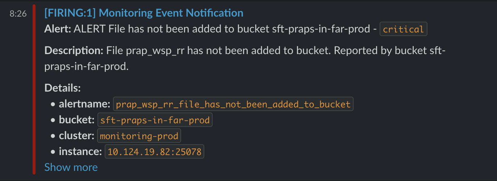
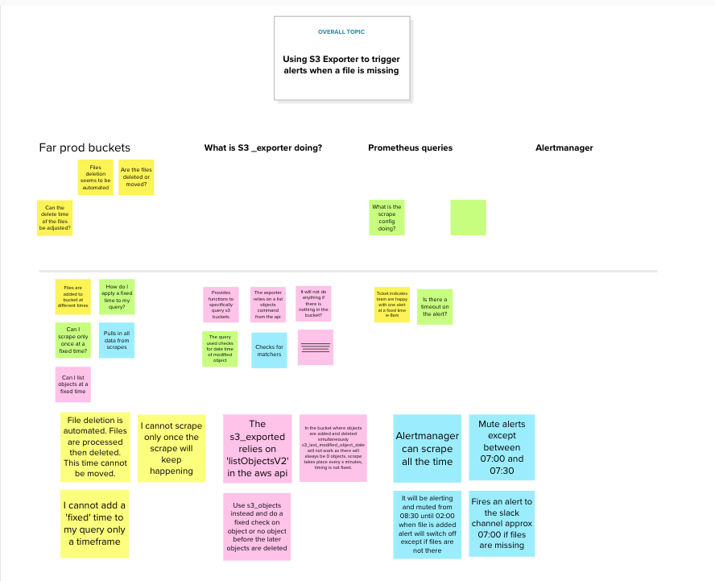
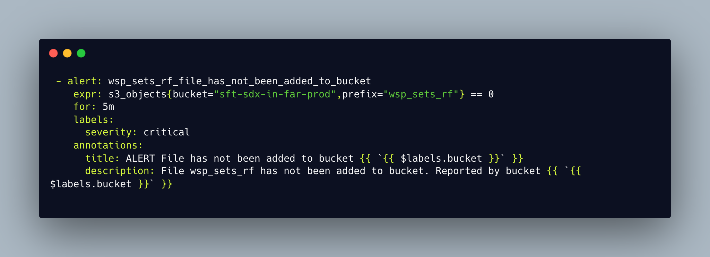
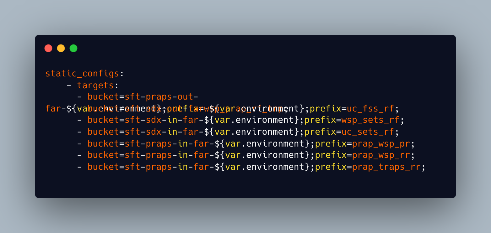
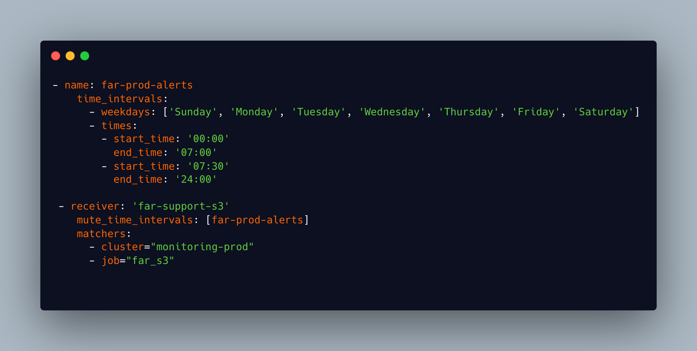

### Situation

A developer team working the Find and Refer service are alerted within a Slack channel when a file is added to some specific targeted AWS s3 buckets. They have made a request which has been added to the HACK team sprint as a working ticket. They have requested that 'to support incident management and ease repetitive cognitive load' they would also like to be alerted when specific files have NOT been added to their buckets by a given time.

### Task

After discussion within team about options, including deploying a Lambda to check buckets and alert, the consensus was that we should use [s3-exporter](https://github.com/ribbybibby/s3_exporter), which is a tool that provides functionality to export Prometheus metrics about s3 buckets and objects. This tool had recently been implemented within the team to scrape buckets and check for backup files. I was assigned this ticket and my task was to implement a new configuration within the monitoring Terraform stack that would scrape the app buckets at given times and alert if files were not present.

### Action

Within the Terraform monitoring stack there is an alert manager module. Alertmanager takes in alerts from the Prometheus server and then sends out notifications to another service, in this case Slack. An alert is the result of an alerting rule set up in Prometheus that is actively firing. My first step was to add a receiver to the alert manager template that would look for alerts from my job rules and send them to the slack channel that I would designate. The file has some global rules that are common to all routes that are set up. A route block defines a node in a routing tree and it's children. Every alert sent by the Prometheus server and traverses these nodes until it finds one matching a job name. A receiver then holds the webhook of the alerting channel that the alert is to be forwarded to. To ensure variables such as the webhook weren't hardcoded into the terraform I added the webhook as a secret in Vault and configured the receiver to pull from there when the alert manager was configured.

*fig 1: An example of the route and receiver configuration for this ticket*

My next step was to create the rules that would trigger the Prometheus alerts. These are written in a yml file which is used when the Docker Prometheus image is built and deployed. Within the yml file you set a name for the rule, which is what the receiver is looking for, and then set some rules for the alert. An expression is written in PromQL, which is a query language for Prometheus, and this sets the parameters that the s3_exporter will use to scrape the buckets. You also format the message that is delivered to Slack within this file.

*fig 2: An example of the rules I created for Prometheus to generate alerts*

I had to test various different queries in my expression to get the desired result. My final example checks for the last modified object in the given bucket and with the given prefix and checks between given times (between 8pm and 11pm in my example). If the object is more than 12 hours old then an alert is triggered.

To include these rules in the Prometheus build I had to update the configuration file so it picked up the new rule. When I deployed in a sandbox environment to test my rules and configuration it did not work and no alerts were generated. I discussed the issue with a colleague on the monitoring team who was more familiar with Alertmanager and Prometheus and he talked me through using the Prometheus UI to test rules. The problem I was experiencing was because the Prometheus scraper had not been given the target file prefixes I was asking it to look for in my rules. My current configuration used existing scraper configurations for the s3_exporter to deliver my alerts. I had to write a new scrape configuration to include in the file that would target the relevant buckets and file prefixes.

*fig 3: My scraper configuration for alerts*

Once I had implemented this configuration I had to run tests. In order to do this, the alert manager configuration had to be applied in the sandbox environment by applying the Terraform in this workspace. I then had to apply my new Prometheus configuration by rebuilding the Docker image. For the test I targeted buckets in the sandbox account that did not have any files and the alert manager picked up the Prometheus alerts and delivered my alert message to a test channel. Everything was set up and working. I finished the task by updating all of my configuration to target the actual production buckets and files that the team wanted alerts for, updating my rules file to capture the times that the files should be uploaded, and created merge requests for my changes. Once these merge requests were reviewed I then needed to deploy my alert manager changes by applying the Terraform in the monitoring stack in both non prod and prod environments and deploying the new Docker Prometheus configuration by running a Jenkins build job in both non prod and prod. I could check my configuration was in place by ssh'ing into the instance and checking that the process was running and by checking the config file on the instance itself. I could also use the Prometheus monitoring UI to verify that I was scraping the correct buckets and check for alerts being triggered.

*fig 4: An example of an alert generated by my rule*

### Result

Everything looked ok initially,  with Prometheus showing my rules and that the correct buckets were being scraped. Over the course of the next few days a lot of alerts started to appear in the far prod alerts channels for non prod buckets. I had considered that, because I had separated the webhooks for the prod and non prod alert channels in Vault that it would not be possible to fire an alert into the incorrect channel however something was going wrong. I reviewed my set up with another member of my team and spoke to the developers to let them know I was working on the issue. In reviewing my initial configuration we highlighted that it would be better to abstract the bucket names into environment variables so alerts would not be generated for missing scrape targets in the non prod environments. I also did some more research and decided to implement some further matchers in the Alertmanager configuration so it would only look for alerts in the prod environments. Again I tested this and it seemed to have the result I wanted so I again rolled it out to production.

A further problem occurred in the week that followed where an alert did not trigger when a file was not added to a bucket. At this point I could not understand why my configuration was not working in the way intended and so I decided to use Mural to create an affinity map of everything I knew was happening and what I needed to find out.[(*K6*)]() This helped me drill into some keys points such as what the code behind the s3_exporter was actually doing, and how the prometheus queries were working in conjunction with Alertmanager. I also spoke to the Dev team to find out more about what was happening with the files once they were added and how the deletion of the files was automated.

*fig 5: My attempt to affinity map to solve my problem using Mural*

My affinity map helped me to see that my PromQL queries were not behaving in the way I had expected them to and that I needed to break out the query in Prometheus from the timing of the alerts which would happen in Alertmanager. With this information I wrote new rules that simply checked if a files was in the relevant bucket. I then updated the receivers in Alertmanager to mute alerts except for within the time window required.[(*4*)]() My logic was that the alerts would fire but not be put into the channel and then when a file was added to the bucket it would stop the alert until after the files were deleted. I tested again, it seemed to work and so I deployed again. This time it looks as though it works as expected with no alerts appearing in the channel that are not supposed to be there.

*fig 6: The new query*

*fig 7: the new scrape targets with environments abstracted to variables*

*fig 8: My solution to use a new mute_time_intervals rule and add matchers for prod only*

Following completion of the ticket I updated the existing documentation for our application of the s3_exporter tool to include more detailed steps of how to add new rules for alerts and I talked my team through the process and how I had completed the ticket in our weekly team Show and Tell.[(*S4*)]() Completing the ticket introduced me to Prometheus and how we as a business use Alertmanager to server alerts to our Slack and Mattermost channels. I had the opportunity to learn about PromQL and how to write effective queries to be able to alert for events or to use for alerting when capacity is above a safe threshold or there is no availability of instances. I had to interact with developers on another team to add more background to the ticket and find out more about how there application was working. Because my solution was not successful the first time I implemented it I had to find a problem solving technique appropriate to the task at hand which was affinity mapping, discuss technical queries with more experienced team members and interrogate the documentation to find my solution. Because I had to keep working on this problem it taught me about the importance of continual improvement, taking ownership of a piece of work, and ensuring that our internal customers had the right solution in place.[(*K23*)]()
