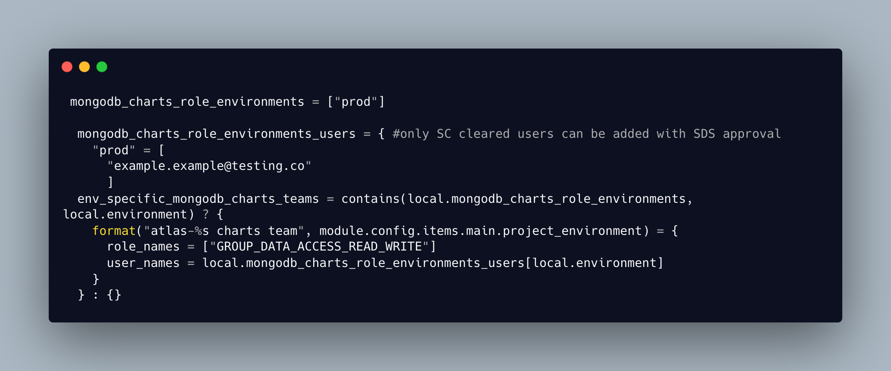

### Situation

A developer from one of the feature teams raised a ticket to be granted access to the production database. They have tested their requirement to provide reports against statistical data in a non production environment and now need production access to inform a local job service trial and future national reporting. They have already raised a ticket with the Secure Design Systems team and have been granted authorisation under DWP guidelines to access the production database for a defined time period.

### Task

SDS have granted permissions for the developer to have Read Only access to the production database and write access to Charts in Mongodb Atlas in line with current security policies and clearances and the Data Protection act 2018. My task is to explore roles and permissions with mongodb atlas Charts to provide the minimum amount of access to the production database whilst still being able to fully use the charts feature and then to implement this in the existing Terraform project stack before documenting the changes.

### Actions

My first step was to review the current Terraform code to see how the data access was currently granted in non prod and what permissions were already in place. This gave me some idea of how permissions currently worked. Users are added to a user group within the Terraform project with roles defined such as Project Owner, Admin Access, Read Only Access. This access is in place for all team members for non production databases with dummy data. For any production access clearance must be granted by Secure Design Systems before anything is implemented by our team as this gives full access to live customer data. In order to ensure that we are using customer data ethically and in line with current data protection legislation, we only grant this access to those that have security clearance and have a legitimate business reason for accessing this data. Data protection legislation can help ensure that companies are held accountable for their use of customer data. Companies may be required to report data breaches or other incidents that could put customer data at risk, and may face penalties if they fail to comply with data protection regulations.[(*K22*)]() By protecting the privacy of our customers and being accountable for how we use their data, it maintains public trust in the DWP and the services that we provide. [(*K3*)]()

I found I could grant a level of Read and Write access to the production database with existing roles. I researched the different roles on the MongoDb website and found a blog post titled ‘Providing Least Privileged Data Access in MongoDb which was very helpful.[(*5*)]() Least privileged Access (LPA) is the principle that a user should be granted access only to the data and operations required to complete a specific task, and then only for as long as needed. I went through the MongoDB documentation for both database access and Charts access. I then tested my access and the process to create charts so I could see what the least possible access would be needed to be able to create charts. The process to do this is to create a Charts user and then select the Database and Fields that you wish to use.

I would need to grant Database Read Access, which is a  level of access above Read Only, which allows the user to select and get data. In peer review with my team, seniors didn’t think this level of access was within the scope of the SDS ticket and so I needed to clarify with SDS if this would be ok. It was also suggested that I should raise a support ticket with MongoDB to confirm the minimum access level to the database to create charts. SDS confirmed that the developers had the necessary security clearance to have full access to the production database for the duration of their task as long as this was subsequently revoked and no access was granted to any other databases. I also received a response from MongoDB support confirming that the level of access I would need to give for Charts functionality would be the Database Read access that I had identified through my research.

I documented the process and applied everything in Terraform so it was a repeatable process and then put in a merge request for my branch. I also commented the code to identify that this was a temporary change. My code was reviewed by a senior engineer and he suggested a refactor using existing resource blocks in the Terraform. I changed my code in line with his suggestion and then put in a second merge request which was accepted and merged to the master branch.

*Fig 1: Example of adding permissions for users as part of a user group*

### Result.

The result of my implementation of Charts functionality for the feature team, in the way that I implemented it, was to successfully give the correct level of access to the production database using Terraform so that it can it can be easily repeated and the access can be easily revoked by targeting a Terraform apply against just the mongodb module. This is a benefit to both the feature team and the infrastructure team as I have carried out all of the research to ensure it gives least privileged access and I have implemented it using an Infrastructure as Code approach which can be quickly and easily repeated. This also has benefits for DWP as it ensures that the business complies with the Data Protection legislation and access is granted appropriately, protecting customers data and privacy.

During the Sprint Review I had the opportunity to talk about the work that I had completed and subject my solution and documentation to the scrutiny of my peers in the team.[(*B1*)]() I learnt about Charts functionality in MongoDB and about levels of access and security and about always being sure to use the least privileged access. In my reading and research I learnt more about Data Protection and our responsibility to protect customers data and privacy by only granting access to the data that is required to fulfil a task and then only for as long as this access is needed.
