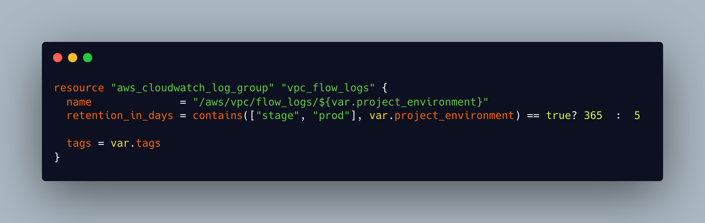

### Situation

VPC flow logs are retained for 30 days in both prod and nonprod environments. Following an audit of logs a ticket was raised to investigate what our log retention periods should be and to make the required changes to our infrastructure.

### Task

The scope of the ticket was to contact Secure Design Services to find out what log retention periods should be set at and then make the required changes to our core-infra stack to implement this.

### Action

I made contact with and spoke to members of the secure design team about our initial proposal to reduce log times to 7 days for Production and 3 days for nonprod. The outcome of this conversation was that this was not advisable and we should be looking to set prod at 365 days and nonprod at 5. The team referred me to the [Centre For Internet Security](https://www.cisecurity.org/cis-benchmarks/) benchmarks which offer configuration guidelines to protect against cyber threats. This benchmark states

> 'By default, CloudWatch Logs will store Logs indefinitely unless a specific retention period is defined for the log group. When choosing the number of days to retain, keep in mind the average days it takes an organization to realize they have been breached is 210 days (at the time of this writing). Since additional time is required to research a breach, a minimum 365 day retention policy allows time for detection and research.'

They also referred me to the [Verizon 2022 Data Breach Report](https://www.verizon.com/business/resources/reports/dbir/), and highlighted that ' 'Time to compromise' to 'time to detection' is typically in the hundreds of days for most organisations'. I communicated this with the rest of the my team, we reviewed these findings and an agreement was reached that we should implement SDS team advice.[(*K18*)]()

I located the relevant module in our core-infra stack that set the log retention time. I quickly implemented a change that I thought would work and submitted a merge request to pull my change into the main branch. This MR was reviewed by other members of the team who highlighted a fault with my solution and advised how they may implement it differently.

*fig 1: My first attempt at a solution. Instead of hard coding a retention time I tried to implement a ternary statement that would check environment and then pick the correct retention period*

One of the senior engineers offered to pair with me on the task and so we set up a call and worked together to implement a second solution. Pair programming is an approach to programming that has become more common in Software development and engineering and there are a number of different approaches. The **Driver-Navigator** style calls for one of the pair to 'Drive' by writing the code whilst their partner 'Navigates' by guiding and proposing solutions. The **Unstructured** approach allows the people pairing to trade off who takes the lead and they can discuss and code together to reach their solution. The **Backseat Navigator** style gives much more control to the navigator who can dictate exactly what code will be written. **Tour Guide** pairing works well for an expert and novice pair and allows the 'Driver' to take full control and to tell the 'Tourist' in the pair what they are doing and why. There is also a **Ping Pong** pairing approach which involves one member of the pair writing tests, whilst the other person writes code to pass this test. In this pair programming session we decided to use the **Driver-Navigator** approach.[(*K20*)]() I took the role of 'driver', writing the code and running plans to test the outcome, whilst the senior engineer took the 'navigator' role, offering advice and highlighting potential errors.[(*S13*)]() We reached a solution that worked but discussed that implementing this would mean having to reference a map of environments and retention times in 30 different terraform stacks, which would have meant 30 more merge requests and reviews. We decided  that this was not the most efficient option. I noted that tags for the project were input as a map which contained the environment variable we needed to make the change in only one module. After some further reading of the Terraform documentation we used Terraform inbuilt functions to reference the variable we needed from the tags map rather than having to create this in each repo. We tested this implementation by running a terraform plan in several environments and found that it worked.

*fig 2: The implemented solution which uses the environment pulled in by project tags and then calls the retention period from a map in the variables.tf file*

### Result

My merge request for this solution was submitted, approved and merged into the codebase. As changes are made to our platform the module will be called and the log retention periods will be gradually updated. Working on this ticket and engaging in productive pair programming with a senior engineer taught me a lot about our technology stack and how we tie our services together. I felt confident in the solution that we reached. Pairing with a senior engineer also taught me a lot of terminal and vscode shortcuts.

As the initial scope of the ticket required me to discuss our current, and desired retention periods, with the Secure Design Team I had the opportunity to make contact with other teams in Digital Engineering and learn about how they interface with my team. I learnt about how the team keep track of current security threats and use these to define how we configure the platform so our users and their data are protected.[(*K22*)]() I also had opportunity in my dealings with Secure Design Team to observe their ways of working and culture and contrast it with my own team. At a basic level communication with the Secure Design Team is different. They have a different ticketing system with a different workflow 'Open', 'In Progress' and 'Done' compared to our workflow which is 'Backlog', 'Selected For Development', 'In Progress', 'Peer Review', 'Ready For Release', and finally 'Done'. They do not use Slack for messaging, as my team and most of the other DevOps and feature teams do, and instead communication is carried out over Mattermost which is an open source platform for secure communications. In my communication with them to negotiate the log retention periods I observed that they were very process driven, needing us to follow strict guidelines, where my team are very outcome driven in that we don't have strict guidelines about what tech or tools to use or how a job should be completed only being concerned with the end result being what we want. In the case of this ticket our goal was to reduce log retention periods down to as low as possible to save costs and resources but this had to be balanced against security concerns as well as stricter processes and guidelines. This experience gave me a good view of how different teams can have different methodologies, tools or mindsets and still work together to achieve common objectives. [(*S2*)]()
