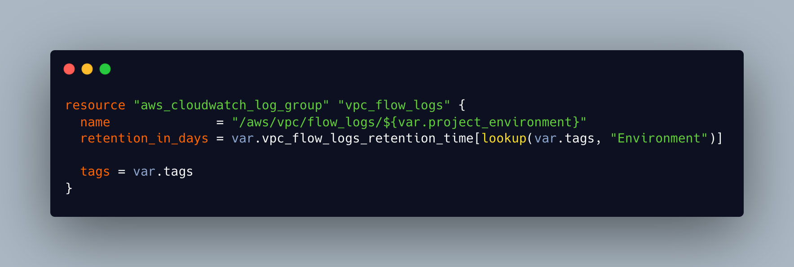

### Situation

VPC flow logs are retained for 30 days in both prod and nonprod environments. Following an audit of logs a ticket was raised to investigate what log retention periods should be set at and to make the required changes to our infrastructure.

### Task

Contact Secure Design Services to find out what log retention periods should be set at and then make the required changes to our core-infra stack to implement this.

### Action

Spoke with secure design about our initial proposal to reduce log times to 7 days for Prod and 3 days for nonprod. Advised that this was not advisable and we should be looking to set prod at 365 days and nonprod at 5 (refer to links given and rationale behind the change). Reviewed these findings with other members of the team and we agreed that we should implement SDS team advice.

Located the relevant module in our core-infra stack that set the log retention time. I quickly implemented a change that I thought would work and submitted an MR. Reviewed by other members of the team who highlighted faults with my solution and advised how they may implement it.

One of the senior engineers offered to pair with me on the task and so we set up a call and worked together to implement a second solution. This solution worked but would have meant having to reference a map of environments and retention times in 30 different terraform stacks, which would have meant 30 more merge requests and reviews. We decided this was not an option. I noted that tags for the project were a map which contained the environment variable we needed so we used Terraform inbuilt functions to reference the variable we needed from the tags map rather than having to create this in each repo. Ran terraform plan in several environments to test and it worked.

*fig 1: The implemented solution

### Result

Learnt a lot about the stack and how we tie our services together from pairing with a senior. Felt confident in my solution. Taught me a lot of terminal and vscode shortcuts and received positive feedback for my solution.
