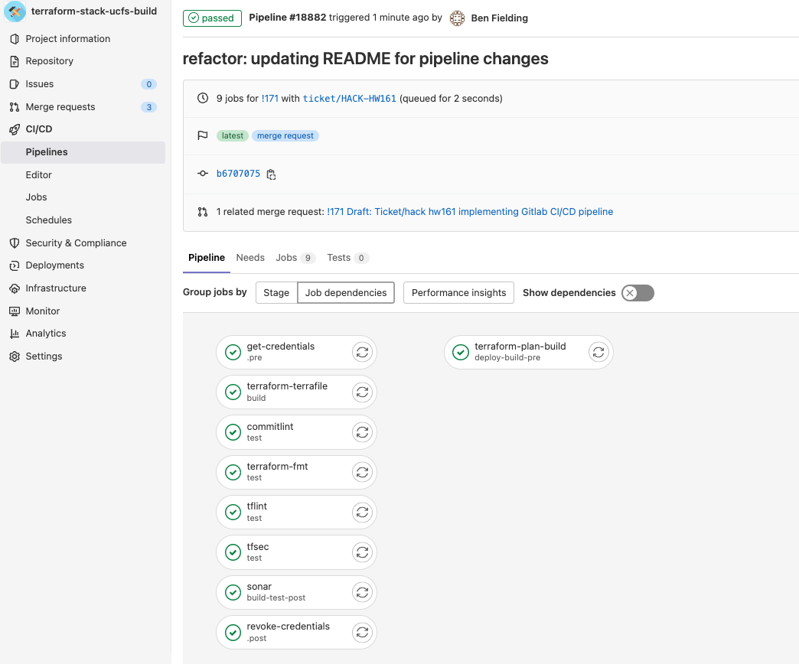
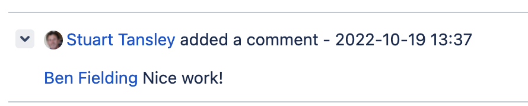

# Miscellaneous Projects and tasks not ticketed

* Updated a script in the 'Getting Started' repo which gave me visibility of Team conventions ie branching the repo, submitting a merge request and notifying the correct Slack channel

* Looked at Go docs and then UCCLI cli. Familiarized myself with the codebase and then decided to pick off an easy first issue. The issue required a link to the release page to be provided when the upgrade command is run. This was found in the update.go file and only required a `fmt.Printf` statement. Submitted merge request and talked through the CI/CD pipeline for the project with product owner.

* Peer reviewed HACK-3095 for Barrington. Remove transit_subnet_route_legacy_common_stage once team have migrated from BB Macs

```
module "transit_subnet_route_legacy_common_stage" {

  source                  = "./vendor/modules/terraform-aws-transit-subnet-route"

  config                  = module.config

  data                    = module.data

  core_infra              = module.core_infra

  target_subnets          = ["public", "private", "data"]

  cidr                    = "10.219.16.0/24"

  conditional_provisoning = local.provision_to_legacy_common_stage

}
```

Involved running terraform plans in 12 repos, reviewing the changes, liasing with other team members to check changes and errors and then merging the feature branch. Ran into problems with vault permissions on the vault stack which I will step through.

### HACK 4175 - adding users to qa2 environment for access to Atlas Mongodb. Had to add email address to environment object in terraform file. Errors thrown so paired with Royston and he explained that user had to have an atlas account before plan could be applied.

Advised mos who raised ticket and once account was set I was able to invite to relevant group. Once invite was accepted then I was able to add to the TF and apply the plan in relevant workspaces so the mos had access

### HACK 4231 - Cert renewal

### HACK 4234 gitlab access for new MOS

### HACK - 161 Move Terraform to Gitlab CI/CD for non prod
s:Implementing gitlab CI/CD in projects in non prod environments
T: Implement Gitlab CI/CD to carry out code checks, plan, and apply Terraform.

prepare and upload yml file for project to https://git.ss.build.uc.internal/dwp/uc/platform/hcl2/cicd-pipelines
reference yml in CI/CD pipeline settings
Update project variables
Update README
A:Written .yml file for project on feature branch in cicd-pipelines

Spoken with Pete - Delivery Systems team who will provide project-config and vault access for the pipeline.
R: implemented pipeline

Received feedback


### Hack 4237 Create AWS account and access using Terraform

### HACK 4235 - abstracting secrets from repo to pull from vault instead -
  when to use plan do check act cycle:
  - starting a new imporvement project
  -developing a new or improved design of a process, product or service
  -implementing any change

  Plan - plan what needs to be done
  what is the core problem that needs to be solved
  what resources do we have
  what resources do we need
  what is the best solution for fixing the problem
  definition of done/what are the goals/what does success look like

  DO - apply everything that has been considered during the previous stage -incorporate on a small scale in a controlled environment

  Check - audit the plans execution see if it worked and monitor, analyse faults and problems

  Act - adopt if objectives met, may become standard baseline, make improvements
  

### HW-277 - Updating onboarding docs and creating off boarding docs including HW273 to update the start-here repo

### HACK 4361 - Fix the FAR Kong Persistence Service NOmad Health Check
s: The Nomad health check for the FAR Kong Traefik service is failing (probably always has). The check isn't valid. 

Example: https://consul.orc.mgmt-prod.uc.internal:8501/ui/eu-west-2/services/traefik-far-prod-kong/instances

refer-to-provision-service/traefik repository.
t:The correct endpoint is /ping. Adjust the health check as necessary, test in sandbox and then roll out to all envs.
a: Clone the repo, update the variables, test.

This did not go as planned -

Original =
check {
        type     = "http"
        port     = "https"
        protocol = "https"
        tls_skip_verify = true
        path     = "/healthcheck"
        interval = "30s"
        timeout  = "15s"
      }

SI suggested change "/healthcheck" to "ping"
May need to change protocol to http?

First run >
Pipeline acceptance always fails on the smoketest script. I need to check this.
Should deploy to <https://consul.orc.mgmt-nonprod.uc.internal:8501/ui/eu-west-2/services>

Agent is alive and reachable but no output at all for the check. Pipeline fails with http error 000 suggesting timeout or nothing at all at endpoint.

Second run >
Change protocol to http

check {
        type     = "http"
        port     = "http"
        protocol = "http"
        tls_skip_verify = true
        path     = "/ping"
        interval = "30s"
        timeout  = "15s"
      }

Something goes wrong with this and it doesn't even deploy?
Tried to deploy again and double checked all of the env variables
This time it deployed but I had forgotten to change to my branch

Tried again and it doesn't seem to deploy even though the pipeline suggests that it does

changed port back to https and left protocol as http which deployed but didn't pass checks again.

Next step is to try endpoint health with this config
Still not giving anything back

Now testing mirroring /metrics (which works) by changing endpoint to /kong

CHanging endpoint back to healthcheck with http protocol

So I need to do a bit of research for the check block. Script seems to indicate /health so I'll try that as well

docs suggest ping is the correct endpoint so why does that not work or not deploy?

check {
        type     = "http"
        port     = "http"
        protocol = "https"
        tls_skip_verify = true
        path     = "/ping"
        interval = "30s"
        timeout  = "15s"
      }

doesn't deploy

check {
        type     = "http"
        port     = "http"
        protocol = "http"
        tls_skip_verify = true
        path     = "/ping"
        interval = "30s"
        timeout  = "15s"
      }

doesn't deploy

Tried running without a specific port and the kong service will not configure and plan fails
Result/Outcome:

Final change looked like:
  check {
    type      = "http"
    port      = "traefik" # which is hitting port 8081
    protocol  = "http"
    tls_skip_verify   = true
    path      = "/ping"
    interval  = "30s"
    timeout   = "15s"
  }

What I discovered through reading the documents and examining the existing job in prometheus(which did work) is that you have to declare a ping endpoint as so:

  traefik-kong:
    dashboard: true
    insecure: true
  ping:
    entryPoint: "traefik"

Change was applied in sandbox and MR merged with no comment. Then I rolled out in all non prod envs. Everything up to stage is handled in gitlab ci/cd with stage and prod being handled in Jenkins still (SDP issue).

### ami-refresh project

overview:

## Task
Brief from team HACK → "Create a Lambda to initiate automated instance refreshes in qa2, stage and prod".
Regular Terraform applys are also needed to update the launch templates with AMIs

QA2, Stage and Prod need to be refreshed every 2 weeks.
General Info
Jenkins pipeline already in place that builds the AMIs at 4pm every Monday.
Proposed solution
Create an AWS lambda to programmatically refresh Autoscaling Groups.

## Phase 1 output summary
Lambda that automatically updates launch templates with latest AMIs, on a predetermined schedule
2nd Lambda that automatically refreshes ASGs on a predetermined schedule
Tags on ASGs enable refresh to be enabled or disabled, time/day tags will set the ASG or AMI refresh time. Adding a warmup_time tag to a ASG will override the default of 300 seconds (to whatever number i set)

### HACK HW-352 Implementation of default tags
The AMI refresh Lambda pulls tags from the auto scaling group for each project for comparison before updating the AMI version on the launch template.

These default tags are set in the ../terraform-aws-project-config module within the variables _workspace.tf file:


variable "ami_refresh_schedule" {
  type = map(object({
    AMI_update_day  = string
    AMI_update_time = string
  }))
  description = "An AMI update schedule for variable Valid Values are HH:MM, mon, tue, wed, thur, fri, sat, sun"
  default = {
    sandbox = {
      AMI_update_day  = "sun"
      AMI_update_time = "19:00"
    },
    dev = {
      AMI_update_day  = "sun"
      AMI_update_time = "19:00"
    },
    qa = {
      AMI_update_day  = "mon"
      AMI_update_time = "15:00"
    },
    qa2 = {
      AMI_update_day  = "tue"
      AMI_update_time = "15:00"
    },
    test = {
      AMI_update_day  = "mon"
      AMI_update_time = "15:00"
    },
    training = {
      AMI_update_day  = "mon"
      AMI_update_time = "15:00"
    },
    build = {
      AMI_update_day  = "mon"
      AMI_update_time = "15:00"
    },
    stage = {
      AMI_update_day  = "tue"
      AMI_update_time = "15:00"
    },
    prod = {
      AMI_update_day  = "wed"
      AMI_update_time = "15:00"
    }
  }
}
With separate tagging for the autoscaling group to give flexibility for setting schedules. These are then referenced in ..terraform-aws-project-config/tags.tf and passed to outputs.tf for use in the project stacks.

Local project override of the schedule is then possible by calling the config tags in ../locals.tf


locals {
  refresh_tags = module.config.items.tags.refresh
}

And setting your own schedule ie


locals {
  ami_refresh_schedule = {
    sandbox = {
      AMI_refresh_day = "mon"
      AMI_refresh_time = "10:00"
    }
  }
}

and then merging your local tags and calling them in the relevant nomad files


locals.tf

locals {
  refresh_tags = merge(module.config.items.tags.refresh, local.ami_refresh_schedule[local.environment])
}

nomad-client-app.tf

tags          = merge(local.tags, { Name = "nomad-app-client-${local.project_environment}" }, local.refresh_tags)

This will ensure that default tags and any local over ride are added to the autoscaling group and instances created.

## Lambda for alert is implemented in Sandbox and Dev currently. The lambda takes outputs from the step function and uses some conditional logic to read the message payload and decide if it's a refresh message or a test result message and then builds the slack message. Final message format and alerting channel will be decide over the next phases of the project.

### HW-372 Create Notification and alerting system for automated refreshes

benfieldingBen Fielding added a comment - 2023-02-09 16:23
Basic alerting functionality here https://eu-west-2.console.aws.amazon.com/lambda/home?region=eu-west-2#/functions/refresh_slack_alerts?newFunction=true&tab=code and tested.

Integrating code with current repo and troubleshooting Terraform.

Edit
Delete

benfielding
Ben Fielding added a comment - 2023-02-12 13:39
Rolled out to sandbox and dev for Monday refresh test.

To update with formatting for error or success, discuss with Tom, Barrington and Hack

Edit
Delete

benfielding
Ben Fielding added a comment - 2023-02-15 08:48
Updated with conditional logic and message formatting, tested and merged.

Edit
Delete

benfielding
Ben Fielding added a comment - 2023-02-15 10:48
The lambda function is currently deployed in Sandbox and Dev https://eu-west-2.console.aws.amazon.com/lambda/home?region=eu-west-2#/functions/refresh_slack_alerts?tab=code

Tests are in place taking a dummy output as it would be sent from the step function for tests and refreshes and currently firing into a private channel for test.

Web hook can be updated once it's decided which channel to use for alerts.

Draft project documentation updated here https://wiki.office.uc.dwpcloud.uk/display/HIWI/Phase+2+-+Smoke+tests+and+Alerting

example code 

``` python

def lambda_handler(event, context):
# variables
  webhook_url = 'https://hooks.slack.com/services/EXAMPLE'
  channel_name = 'ami-refresh'
  log_message = event
  message = 'ASG REFRESH'
  attachment = []
  color = 'good'
  title = ''

# processing different message types 
  result = log_message.keys()
  if 'Payload' in result:
    res = log_message['Payload']['Payload']['Test_result']
    if res == 'pass':
      message = 'ASG tests passed, refresh complete'
      title = log_message['Payload']['Payload']['slack_message']
    elif res == 'fail':
      message = 'ASG tests failed, starting rollback'
      title = log_message['Payload']['Payload']['slack_message']
      color = 'danger'
  elif 'InstanceRefreshState' in result:
    res = log_message['InstanceRefreshState']
    if res == 'Started':
      asg = log_message['ASG_name']
      message = 'Starting ASG Refresh'
      title = 'Starting refresh of ' + asg

  # set up contents of message
  attachment_value = {}
  attachment_value['color'] = color
  attachment_value['title'] = title
  attachment.append(attachment_value)

# once trigger is received then send the message
  message_payload = {
    'text': message,
    'channel': channel_name,
    'attachments': attachment
  }

  req_slack = Request(webhook_url, json.dumps(message_payload).encode('utf-8'))
  response = urlopen(req_slack)
  response.read()
  logger.info("Message posted to %s", message_payload['channel'])

```
### HW-382 Identify all projects to include

Involved tagging and applying terraform to add the resource tags

### HW-428 Review and Adjust Notification format

Move the notification lambda code into a class so we can unify the lambdas. Update the notification format so that only one notification for eahc stage fires, instead of multiple notifications

Description
at the moment we have notifications for refresh starting, test result (refresh finished, test passes or rollback starting, test failed. This gives a separate notification for each ASG (a lot of notifications)
Could we combine notifications
Ultimately we won't be notifying that a test has passed, only in failure. We could have a separate channel for all the notifications and then put just the essential ones somewhere else ie HACK Support?
Also implement a notification cycle for the AMI template update part of the project as these will happen at different days/times to the ASG refresh once the project is rolled out beyond phase 1.

Created #uc-hack-nonprod-refresh channel for testing and future use

Created a webhook for channel and added to 'secrets-infra/ami-refresh/lambda-slack-alert/nonprod'

Added logic to infra to pull webhook from vault instead of hard coding. Only nonprod set up atm so will be added to/adjusted accordingly as we move along 


benfielding
Ben Fielding added a comment - 2023-04-21 15:46
Revised slack lambda into a python class to integrate into central Lambda (rather than having 4 Lambda's).

Tested in sandbox with messages firing into the relevant channel.

new python code 

```python

class SlackNotifications:
    """Class to handle slack notifications for refresh"""

    def __init__(self, event, context):
        self.event = event
        self.type = event['notificationtype']
        self.env = ""
        self.proj = []
        self.color = 'good'
        self.notification = 'ASG REFRESH NOTIFICATION'

    def __is_plural(self, array):
        if len(array) == 1:
            return ""
        else:
            return "s"

    def start_refresh(self):
        """method to send refresh start message"""
        # Work through the asg list and pull values from each dict
        asg_ref = self.event['AutoScalingGroups']
        for i in asg_ref:
            tags = i['Tags']
            env_dict = next(
                (item for item in tags if item['Key'] == 'Environment'), None)
            proj_dict = next(
                (item for item in tags if item['Key'] == 'Project'), None)
            self.env = env_dict['Value']
            self.proj.append(proj_dict['Value'])
            asg_projects = list(set(self.proj))

        # put together message text and return
        message = f"The instance refresh is starting in {self.env} for {str(len(asg_projects))} project{self.__is_plural(asg_projects)}. Projects being refreshed are: {', '.join(asg_projects)}"
        return self.__slack_message(message)

    def end_refresh(self):
        """method to send refresh end message"""
        asg_ref = self.event['AutoScalingGroups']
        fail_count = 0
        error_count = 0
        for i in asg_ref:
            res = i.get('Test_result')
            if res != None:
                env_dict = next(
                    (item for item in i['Tags'] if item['Key'] == 'Environment'), None)
                if res['Payload']['test_result'] == 'Fail':
                    fail_count += 1
                    self.color = 'danger'
                    self.notification = 'ASG REFRESH ALERT - FAILED REFRESH'
            else:
                error_count += 1
        rate = ((len(asg_ref)-(fail_count+error_count))/len(asg_ref)) * 100
        message = f"The instance refresh of {str(len(asg_ref))} autoscaling groups in {str(env_dict['Value'])} has completed and was {str(rate)} % successful. Please see logs by clicking <https://eu-west-2.console.aws.amazon.com/states/home?region=eu-west-2#/v2/executions/details/{self.event['execution_id']}|here>."
        return self.__slack_message(message)

    def failed_test(self):
        job = self.event['ASG_info']['new_asg_config']['AutoScalingGroups'][0]["AutoScalingGroupName"]
        message = f"ASG tests failed for {job}. Starting rollback, manual checks advised."
        self.color = 'danger'
        return self.__slack_message(message)

    def __call__(self):
        if self.type == 'start':
            return self.start_refresh()
        if self.type == 'end':
            return self.end_refresh()

    def __slack_message(self, message):
        """private method to compile and send the message"""
        # variables
        slack_url = os.getenv('WEB_HOOK_URL')
        # Prepare and send a message to Slack with the combined payload
        # set up contents of message
        attachment = []
        attachment_value = {}
        attachment_value['color'] = self.color
        attachment_value['title'] = message
        attachment.append(attachment_value)
        message_payload = {
            'attachments': attachment,
            'text': self.notification
        }
        proxy = {"https": os.getenv("PROXY")}
        post(slack_url, json=message_payload, proxies=proxy, verify=False)
        logger.info("Message posted to uc-hack-nonprod-refresh")

```
Update Terraform HW 458


