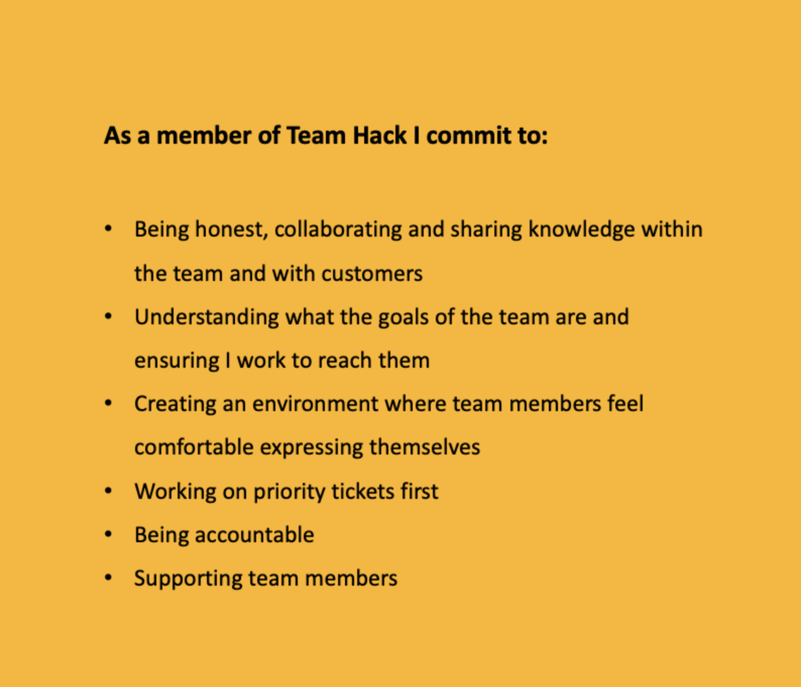

# Introduction

### About Me

I am Ben Fielding and I work at Department for Work and Pensions, within the Digital Group, as an Apprentice DevOps engineer. My background is mainly in the private sector working within the parking industry. Some of my experience with technology was gained through configuring and repairing parking equipment. Prior to being made redundant in January 2020 I was department lead on a project to build and launch a parking app, which gave me some experience of writing tests, testing, doing user research and working in sprints. The process gave me a renewed interest in web development and the ways in which technology can make people's lives better or easier. After speaking to some people I knew who were working in the tech industry I decided to self-learn web development with Udemy and freeCodeCamp and apply for apprenticeships or entry level tech roles.

When the pandemic came along I took a position with DWP in one of the Working Age Habitual Residence Test teams as a Decision Maker. It was whilst working in this role, and still studying different aspects of the Web, that I saw an internal posting for the DevOps apprenticeship and applied. The apprenticeship started with an 18 week Makers Bootcamp to give us an overview of all aspects of programming, cloud technologies and DevOps specific skills and was an excellent grounding in the types of technology we would be using with DWP. I am excited to start my placement and work in the public sector providing infrastructure and platform support for Universal Credit, where I know I'll be helping to make a difference to the lives of people who need some extra support.

### About DWP Digital

The Department for Work and Pensions (DWP) is responsible for welfare, pensions and child maintenance policy. As the UK's biggest public service department it administers the State Pension and a range of working age, disability and ill health benefits to around 20 million claimants and customers. DWP Digital aspires to become a leading example of [agile delivery](https://about.gitlab.com/topics/agile-delivery/) and are building a team of digital specialists to make simpler, clearer, faster services that put the people who use them first. Their services touch the lives of almost everyone in the UK at some point. Their IT systems manage 7.35 million benefit claims each year, paying £165 billion in benefits and pensions.

### My Team

I work within the HackIT team who are a DevOps team that build and support the infrastructure for products and projects on the Universal Credit platform. We work closely with the feature teams in Leeds and Manchester and aspire to work in a way that increases the flow of value from a Developer writing code through to the end user.
The team is comprised of a Tech Lead, a Delivery Manager , an Architect, two senior DevOps Engineers, a Junior DevOps Engineer, three contractors and then myself and another Apprentice DevOps Engineer.[(*K22*)]() As we apprentices have joined the team they have moved to using Scrum to manage their work cycles. Scrum is an agile methodology where work is executed in short and periodic sprints, in this case two weeks. A planning meeting takes place at the beginning of the cycle where everyone agrees which tickets will be taken into the sprint and reach a consensus on the complexity of each task. Daily scrum meetings take place to update on work that has taken place and any blockers and then a retro is held at the end of the sprint. [(*S8*)]()

At the moment we work on a hybrid basis which means we spend two days per week in the office and the rest of the time working from home. The team has many communication channels when not in the office, using Slack primarily but also Microsoft Teams. We use a product called Mural for online, shared whiteboarding and presenting. Throughout the working week there are 'Show and Tell' meetings for the Infrastructure teams to demo work they have done as well as a weekly 'Town Hall' meeting for general communications from the business. The team has also created a comprehensive wiki which contains information for the wider business about the team hierarchy, what products we support, our 'Roadmap' and wider goals. This wiki also contains information for onboarding and documentation such as Runbooks and How to's. Within this I have opportunity to engage in self led learning [(*B2*)](), with licenses to Pluralsight and Cloud Guru being provided by the business, and complete Apprenticeship work as well as working on tickets from the shared Kanban board with support from my Line Manager and other members of the team.

*figure 1 The Team HACK team charter*

### Legislation and Compliance

I have completed DSE (Display Screen Equipment) guidance on starting which outlines how to correctly set up my working environment in the office and at my home desk. This training covered positioning desk, seating, screen and keyboard. Health and Safety training also covered identifying hazards in the workplace. In addition to this training had to be completed in Security and Data Protection at DWP and Public Sector Equality Duty.

<!-- [^1]: [K22]() -->
<!-- [^2]: [S8]() -->
<!-- [^3]: [B2]() -->
