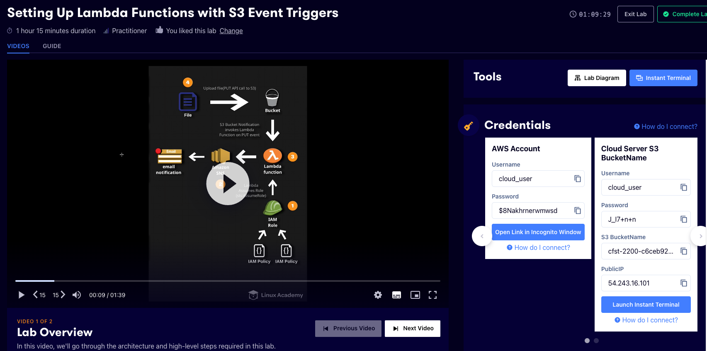
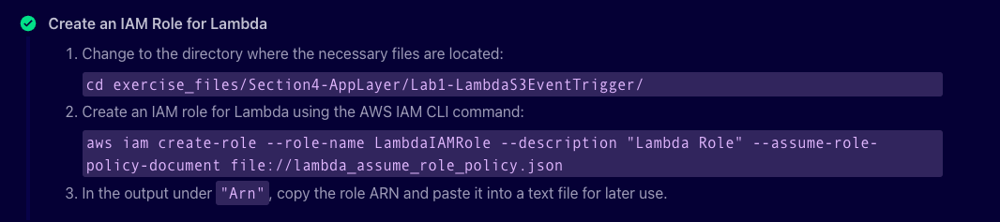
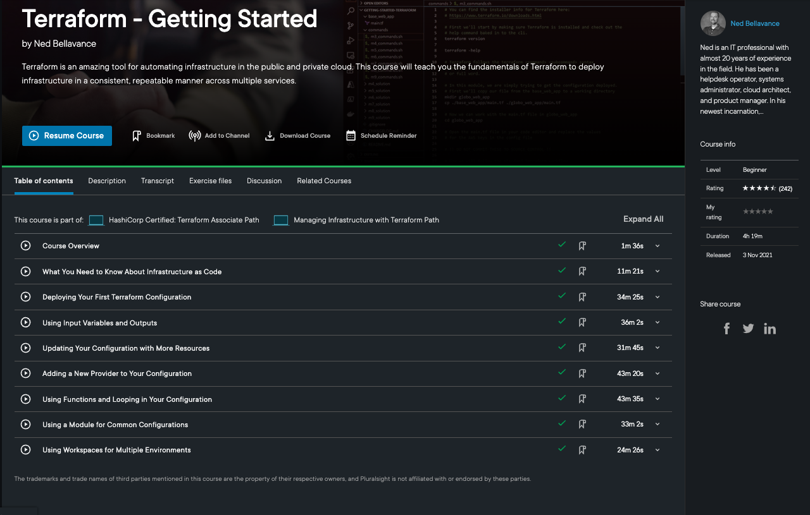

# Examples of course content covered in self led learning

### A Cloud Guru - Setting Up Lambda Functions with S3 Event Triggers

This was a 'hands on lab' which Cloud Guru describe as 'real environments created by industry experts to help you learn'. THe objective of this lab was to create a Lambda function for AWS with an S3 event trigger to execute the Lambda logic. This Lambda would then send an email.

*Fig 1: An example of the cloud guru lab setup*

*Fig 2: An example of the material that accompanies the lab videos*

### Terraform - Getting Started

This course is part of the Hashicorp Certified: Terraform Associate pathway on Pluralsight which acts as preparation for the certification exam.[K25]

The course covers the basics of Infrastructure as code before getting into Terraform specifics. The first module covers essential foundational knowledge of Hashicorps Terraform software. In this I covered the foundations of writing, planning and creating automated Infrastructure deployments. It covered the basic Terraform configuration and then covered using functions,modules and worksapces which is very relevant for my placement role.

*Fig 3: An overview of the course content*

