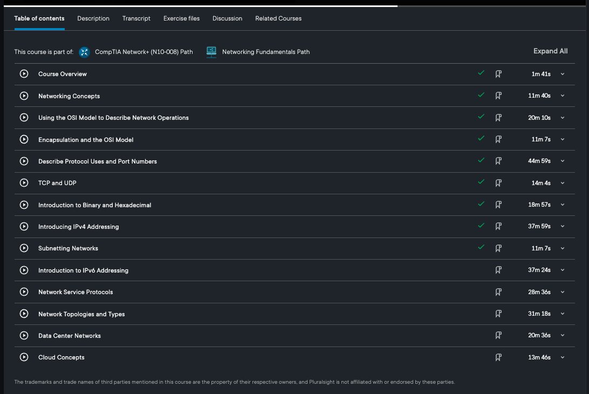
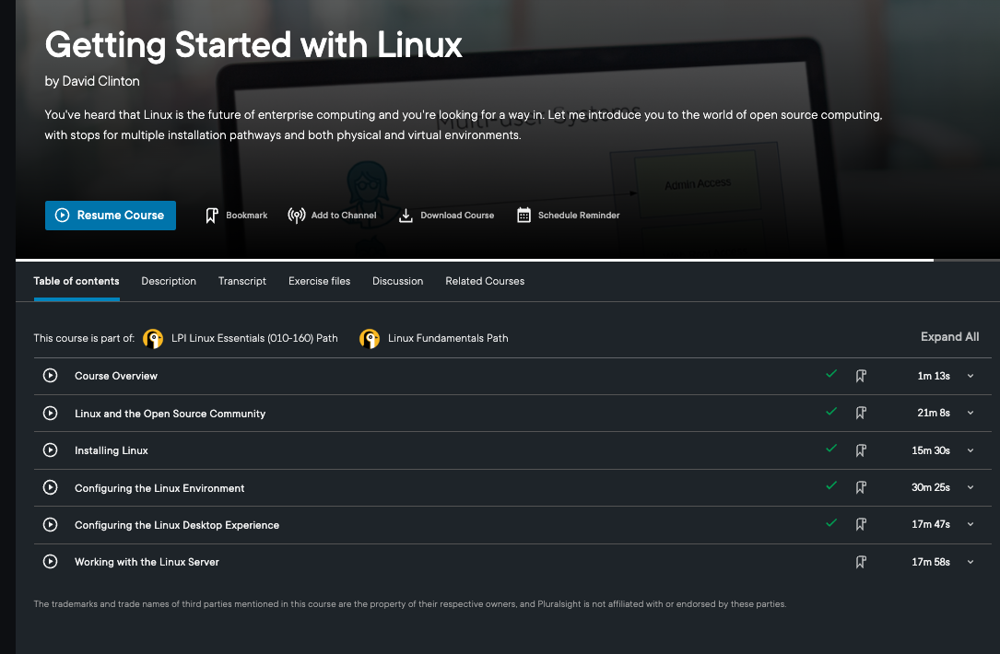
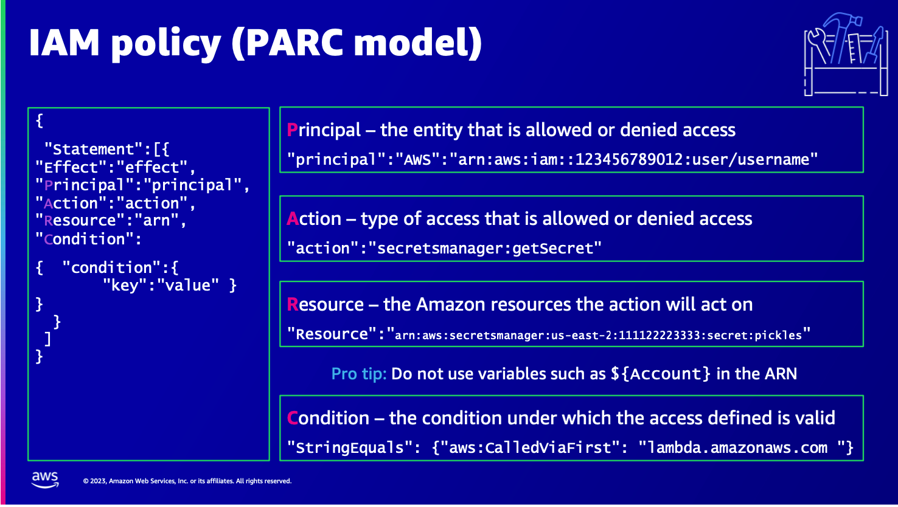
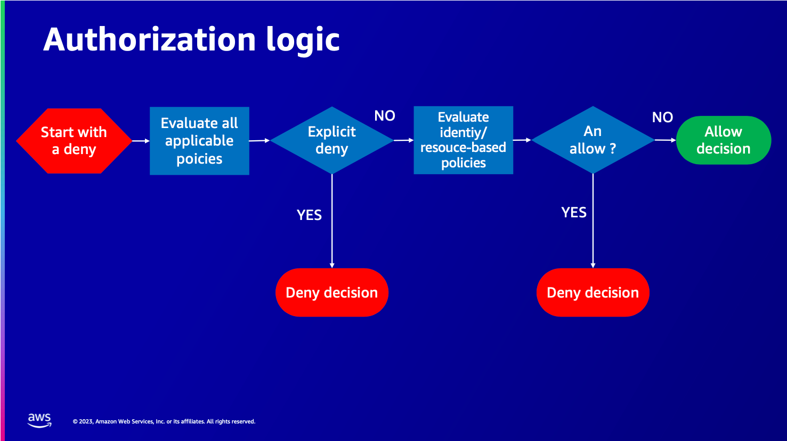

# Examples of course content covered in self led learning

### A Cloud Guru - Setting Up Lambda Functions with S3 Event Triggers

This was a 'hands on lab' which Cloud Guru describe as 'real environments created by industry experts to help you learn'. THe objective of this lab was to create a Lambda function for AWS with an S3 event trigger to execute the Lambda logic. This Lambda would then send an email.

*Fig 1: An example of the cloud guru lab setup*

*Fig 2: An example of the material that accompanies the lab videos*

### Terraform - Getting Started

This course is part of the Hashicorp Certified: Terraform Associate pathway on Pluralsight which acts as preparation for the certification exam.[(*K25*)]()

The course covers the basics of Infrastructure as code before getting into Terraform specifics. The first module covers essential foundational knowledge of Hashicorps Terraform software. In this I covered the foundations of writing, planning and creating automated Infrastructure deployments. It covered the basic Terraform configuration and then covered using functions,modules and worksapces which is very relevant for my placement role.

*Fig 3: An overview of the course content*

### Network Concepts And Protocols

This course is designed to teach the fundamentals of data networking and is part of the CompTIA Network+ learning pathway.

*Fig 4: An overview of the course contents*

### Getting Started with Linux

This course teaches you the basics of installing and managing Linux systems and is part of the LPI Linux Essentials Path. The course introduces you to the Linux OS and open source software. It covers installing and managing server applications such as the Apache web server. As part of the course I have utilised Oracle Virtualbox to set up and manage a Centos server.

*Fig 5: An overview of the course contents*

### Understanding IAM

This was an AWS Tech enablement session hosted by AWS and attended online via Teams. The hour long session covered IAM foundation principles, writing IAM policies and working towards least privilege when defining policies and permissions for cloud resources. There was a short quiz by the facilitator to check understanding.

*Fig 6: AWS IAM policy types*

*Fig 7: AWS PARC model*

*Fig 8: AWS authorisation logic*

